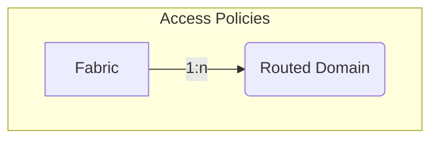

# Access Policies

An ACI Fabric contains access policies that define how tenant policies can be
attached to the fabric infrastructure. Access policy objects are scoped to an
ACI Fabric and can be referenced by tenant policy objects such as L3Outs.

## Routed Domain

A *Routed Domain* represents an ACI L3 Domain used for routed external
connectivity. Routed Domains are defined under the ACI Fabric access policies
and can be referenced by L3Out policy.

The *ACIRoutedDomain* model has the following fields:

*Required fields*:

- **Name**: represents the Routed Domain name in the ACI.
- **ACI Fabric**: a reference to the `ACIFabric` model.

*Optional fields*:

- **Name alias**: a name alias in the ACI for the Routed Domain.
- **Description**: a description of the Routed Domain.
- **NetBox Tenant**: a reference to the NetBox tenant model.
- **Security domains**: a comma-separated list of ACI security domains.
- **Comments**: a text field for additional notes.
- **Tags**: a list of NetBox tags
