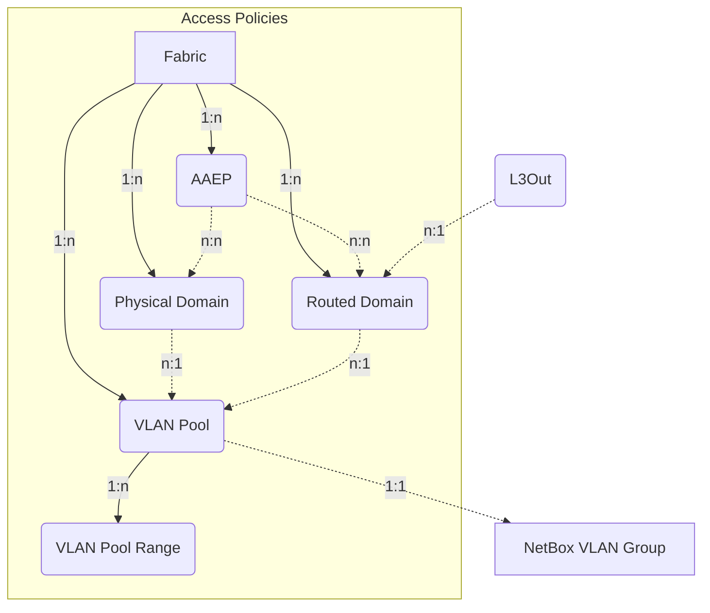

# Access Policies

An ACI Fabric contains access policies that define how tenant policies can be
attached to the fabric infrastructure. Access policy objects are scoped to an
ACI Fabric and can be referenced by tenant policy objects such as L3Outs.

```mermaid
flowchart TD
    FAB[Fabric]
    AAEP(AAEP)
    PD(Physical Domain)
    RD(Routed Domain)
    L3O(L3Out)
    VP(VLAN Pool)
    VPR(VLAN Pool Range)
    NBVG[NetBox VLAN Group]

    subgraph graphAP [Access Policies]
        FAB -->|1:n| AAEP
        FAB -->|1:n| PD
        FAB -->|1:n| RD
        FAB -->|1:n| VP
        VP -->|1:n| VPR
        AAEP -.->|n:n| PD
        AAEP -.->|n:n| RD
        PD -.->|n:1| VP
        RD -.->|n:1| VP
    end
    L3O -.->|n:1| RD
    VP -.->|1:1| NBVG
```

## Physical Domain

A *Physical Domain* represents an ACI physical domain (`physDomP`) used for
bare-metal and hypervisor connectivity. Physical Domains are defined under
the ACI Fabric access policies and can be referenced by EPG domain bindings.

The *ACIPhysicalDomain* model has the following fields:

*Required fields*:

- **Name**: represents the Physical Domain name in the ACI.
- **ACI Fabric**: a reference to the `ACIFabric` model.

*Optional fields*:

- **Name alias**: a name alias in the ACI for the Physical Domain.
- **Description**: a description of the Physical Domain.
- **Security domains**: a comma-separated list of ACI security domains.
- **ACI VLAN Pool**: an optional reference to an `ACIVLANPool` that defines
  the VLANs available to this domain. The pool must belong to the same
  ACI Fabric as the Physical Domain.
- **NetBox Tenant**: a reference to the NetBox tenant model.
- **Comments**: a text field for additional notes.
- **Tags**: a list of NetBox tags.

*Validation rules*:

- Each domain name in **Security domains** must be unique within the list
  (duplicates are rejected).
- The `(aci_fabric, name)` combination must be unique per fabric.

AAEP bindings for a Physical Domain are managed on the domain's detail
page via the **AAEPs** tab.

## Routed Domain

A *Routed Domain* represents an ACI L3 Domain used for routed external
connectivity. Routed Domains are defined under the ACI Fabric access policies
and can be referenced by L3Out policy.

The *ACIRoutedDomain* model has the following fields:

*Required fields*:

- **Name**: represents the Routed Domain name in the ACI.
- **ACI Fabric**: a reference to the `ACIFabric` model.

*Optional fields*:

- **Name alias**: a name alias in the ACI for the Routed Domain.
- **Description**: a description of the Routed Domain.
- **Security domains**: a comma-separated list of ACI security domains.
- **ACI VLAN Pool**: an optional reference to an `ACIVLANPool` that defines
  the VLANs available to this domain. The pool must belong to the same
  ACI Fabric as the Routed Domain.
- **NetBox Tenant**: a reference to the NetBox tenant model.
- **Comments**: a text field for additional notes.
- **Tags**: a list of NetBox tags.

*Validation rules*:

- Each domain name in **Security domains** must be unique within the list
  (duplicates are rejected).
- The `(aci_fabric, name)` combination must be unique per fabric.

AAEP bindings for a Routed Domain are managed on the domain's detail
page via the **AAEPs** tab.

## VLAN Pool

A *VLAN Pool* represents an ACI VLAN instance profile (`fvnsVlanInstP`),
a fabric-scoped collection of VLAN encapsulation ranges with a common
allocation mode. VLAN pools group one or more VLAN ranges and are consumed
by ACI domains to define which VLANs those
domains may use.

The *ACIVLANPool* model has the following fields:

*Required fields*:

- **Name**: the VLAN pool name in the ACI.
- **ACI Fabric**: a reference to the `ACIFabric` model.
- **Allocation mode**: controls how VLANs in the pool are assigned.
    - Values: `static` (static), `dynamic` (dynamic)
    - Default: `static`
    - Static pools use manually defined ranges; dynamic pools allow
      the APIC to assign VLANs automatically (typically for VMM domains).

*Optional fields*:

- **Name alias**: a name alias in the ACI for the VLAN pool.
- **Description**: a description of the VLAN pool.
- **NetBox VLAN group**: an optional one-to-one reference to a NetBox
  `VLANGroup` that documents the same set of VLAN resources. When set, every
  VLAN pool range must fall within the group's VID ranges.
- **NetBox tenant**: association to a NetBox Tenant.
- **Comments**: a text field for notes (Markdown supported).
- **Tags**: a list of NetBox tags.

VLAN ranges belonging to a pool are managed on the pool's detail page
via the **VLAN Pool Ranges** tab.

## VLAN Pool Range

A *VLAN Pool Range* represents an ACI encapsulation block (`fvnsEncapBlk`),
a contiguous block of VLAN IDs within a VLAN pool. Each range defines a
start VLAN, an end VLAN, an allocation mode override, and a role.

The *ACIVLANPoolRange* model has the following fields:

*Required fields*:

- **ACI VLAN Pool**: a reference to the parent `ACIVLANPool`.
- **VLAN ID (from)**: the first VLAN ID in the block.
    - Values: `1-4094`
- **VLAN ID (to)**: the last VLAN ID in the block.
    - Values: `1-4094`

*Optional fields*:

- **Allocation mode**: per-range override of the pool allocation mode.
    - Values: `inherit` (inherit), `static` (static), `dynamic` (dynamic)
    - Default: `inherit`
    - When set to `inherit`, the range uses the parent pool's allocation
      mode.
- **Role**: the intended use of VLANs in this block.
    - Values: `external` (external), `internal` (internal)
    - Default: `external`
- **Comments**: a text field for notes (Markdown supported).
- **Tags**: a list of NetBox tags.

*Validation rules*:

- The starting VLAN ID must not be greater than the ending VLAN ID.
- A range must not overlap any existing range within the same pool.

## Attachable Access Entity Profile

An *Attachable Access Entity Profile* (AAEP) represents an ACI attachable
access entity profile (`infraAttEntityP`) that ties interface policy groups to
physical and routed domains, and optionally enables the infrastructure VLAN on
the associated ports.

The *ACIAttachableAccessEntityProfile* model has the following fields:

*Required fields*:

- **Name**: represents the AAEP name in the ACI.
- **ACI Fabric**: a reference to the `ACIFabric` model.

*Optional fields*:

- **Name alias**: a name alias in the ACI for the AAEP.
- **Description**: a description of the AAEP.
- **Infrastructure VLAN**: a boolean field, whether the infrastructure VLAN is
  enabled on ports associated with this AAEP.
    - Default: `false`
- **NetBox Tenant**: a reference to the NetBox tenant model.
- **Comments**: a text field for additional notes.
- **Tags**: a list of NetBox tags.

*Validation rules*:

- The `(aci_fabric, name)` combination must be unique per fabric.

Domain bindings for an AAEP are managed on the profile's detail page via
the **Domain Bindings** tab.

## AAEP Domain Binding

An *AAEP Domain Binding* represents an ACI domain-to-AAEP association
(`infraRsDomP`) that links an AAEP to a Physical Domain or a Routed Domain.
Each binding associates exactly one AAEP with exactly one domain, and the
domain must belong to the same ACI Fabric as the AAEP.

The *ACIAAEPDomainBinding* model has the following fields:

*Required fields*:

- **ACI AAEP**: a reference to the parent `ACIAttachableAccessEntityProfile`.
- **ACI domain object**: the Physical Domain or Routed Domain to associate with
  the AAEP.

*Optional fields*:

- **Comments**: a text field for additional notes.
- **Tags**: a list of NetBox tags.

*Validation rules*:

- The assigned domain must belong to the same ACI Fabric as the parent AAEP.
- Each `(aci_aaep, domain)` combination must be unique (an AAEP cannot be
  bound to the same domain twice).
