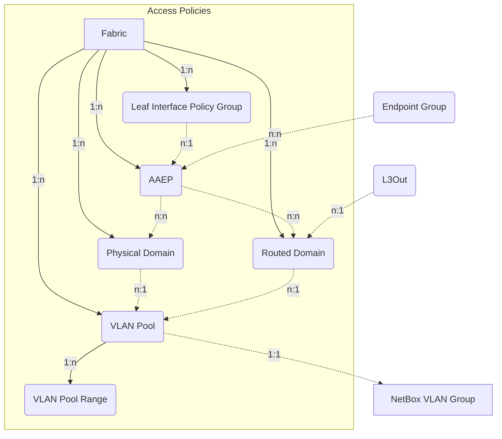

# Access Policies

An ACI Fabric contains access policies that define how tenant policies can be
attached to the fabric infrastructure. Access policy objects are scoped to an
ACI Fabric and can be referenced by tenant policy objects such as L3Outs.

```mermaid
flowchart TD
    FAB[Fabric]
    AAEP(AAEP)
    PD(Physical Domain)
    RD(Routed Domain)
    L3O(L3Out)
    EPG(Endpoint Group)
    VP(VLAN Pool)
    VPR(VLAN Pool Range)
    LIPG(Leaf Interface Policy Group)
    NBVG[NetBox VLAN Group]

    subgraph graphAP [Access Policies]
        FAB -->|1:n| AAEP
        FAB -->|1:n| PD
        FAB -->|1:n| RD
        FAB -->|1:n| VP
        FAB -->|1:n| LIPG
        VP -->|1:n| VPR
        AAEP -.->|n:n| PD
        AAEP -.->|n:n| RD
        PD -.->|n:1| VP
        RD -.->|n:1| VP
        LIPG -.->|n:1| AAEP
    end
    L3O -.->|n:1| RD
    EPG -.->|n:n| AAEP
    VP -.->|1:1| NBVG
```

## Physical Domain

A *Physical Domain* represents an ACI physical domain (`physDomP`) used for
bare-metal and hypervisor connectivity. Physical Domains are defined under
the ACI Fabric access policies and can be referenced by EPG domain bindings.

The *ACIPhysicalDomain* model has the following fields:

*Required fields*:

- **Name**: represents the Physical Domain name in the ACI.
- **ACI Fabric**: a reference to the `ACIFabric` model.

*Optional fields*:

- **Name alias**: a name alias in the ACI for the Physical Domain.
- **Description**: a description of the Physical Domain.
- **Security domains**: a comma-separated list of ACI security domains.
- **ACI VLAN Pool**: an optional reference to an `ACIVLANPool` that defines
  the VLANs available to this domain. The pool must belong to the same
  ACI Fabric as the Physical Domain.
- **NetBox Tenant**: a reference to the NetBox tenant model.
- **Comments**: a text field for additional notes.
- **Tags**: a list of NetBox tags.

*Validation rules*:

- Each domain name in **Security domains** must be unique within the list
  (duplicates are rejected).
- The `(aci_fabric, name)` combination must be unique per fabric.

AAEP bindings for a Physical Domain are managed on the domain's detail
page via the **AAEPs** tab.

## Routed Domain

A *Routed Domain* represents an ACI L3 domain used for routed external
connectivity. Routed Domains are defined under the ACI Fabric access policies
and can be referenced by L3Out policy.

The *ACIRoutedDomain* model has the following fields:

*Required fields*:

- **Name**: represents the Routed Domain name in the ACI.
- **ACI Fabric**: a reference to the `ACIFabric` model.

*Optional fields*:

- **Name alias**: a name alias in the ACI for the Routed Domain.
- **Description**: a description of the Routed Domain.
- **Security domains**: a comma-separated list of ACI security domains.
- **ACI VLAN Pool**: an optional reference to an `ACIVLANPool` that defines
  the VLANs available to this domain. The pool must belong to the same
  ACI Fabric as the Routed Domain.
- **NetBox Tenant**: a reference to the NetBox tenant model.
- **Comments**: a text field for additional notes.
- **Tags**: a list of NetBox tags.

*Validation rules*:

- Each domain name in **Security domains** must be unique within the list
  (duplicates are rejected).
- The `(aci_fabric, name)` combination must be unique per fabric.

AAEP bindings for a Routed Domain are managed on the domain's detail
page via the **AAEPs** tab.

## VLAN Pool

A *VLAN Pool* represents an ACI VLAN instance profile (`fvnsVlanInstP`),
a fabric-scoped collection of VLAN encapsulation ranges with a common
allocation mode. VLAN Pools group one or more VLAN ranges and are consumed
by ACI domains to define which VLANs those
domains may use.

The *ACIVLANPool* model has the following fields:

*Required fields*:

- **Name**: the VLAN Pool name in the ACI.
- **ACI Fabric**: a reference to the `ACIFabric` model.
- **Allocation mode**: controls how VLANs in the pool are assigned.
    - Values: `static` (static), `dynamic` (dynamic)
    - Default: `static`
    - Static pools use manually defined ranges. Dynamic pools allow
      the APIC to assign VLANs automatically (typically for VMM domains).

*Optional fields*:

- **Name alias**: a name alias in the ACI for the VLAN Pool.
- **Description**: a description of the VLAN Pool.
- **NetBox VLAN group**: an optional one-to-one reference to a NetBox
  `VLANGroup` that documents the same set of VLAN resources. When set, every
  VLAN Pool range must fall within the group's VID ranges.
- **NetBox tenant**: association to a NetBox tenant.
- **Comments**: a text field for notes (Markdown supported).
- **Tags**: a list of NetBox tags.

VLAN ranges belonging to a pool are managed on the pool's detail page
via the **VLAN Pool Ranges** tab.

## VLAN Pool Range

A *VLAN Pool Range* represents an ACI encapsulation block (`fvnsEncapBlk`),
a contiguous block of VLAN IDs within a VLAN Pool. Each range defines a
start VLAN, an end VLAN, an allocation mode override, and a role.

The *ACIVLANPoolRange* model has the following fields:

*Required fields*:

- **ACI VLAN Pool**: a reference to the parent `ACIVLANPool`.
- **VLAN ID (from)**: the first VLAN ID in the block.
    - Values: `1-4094`
- **VLAN ID (to)**: the last VLAN ID in the block.
    - Values: `1-4094`

*Optional fields*:

- **Allocation mode**: per-range override of the pool allocation mode.
    - Values: `inherit` (inherit), `static` (static), `dynamic` (dynamic)
    - Default: `inherit`
    - When set to `inherit`, the range uses the parent pool's allocation
      mode.
- **Role**: the intended use of VLANs in this block.
    - Values: `external` (external), `internal` (internal)
    - Default: `external`
- **Comments**: a text field for notes (Markdown supported).
- **Tags**: a list of NetBox tags.

*Validation rules*:

- The starting VLAN ID must not be greater than the ending VLAN ID.
- A range must not overlap any existing range within the same pool.

## Attachable Access Entity Profile

An *Attachable Access Entity Profile* (AAEP) represents an ACI attachable
access entity profile (`infraAttEntityP`) that ties interface policy groups to
physical and routed domains, and optionally enables the infrastructure VLAN on
the associated ports.

The *ACIAttachableAccessEntityProfile* model has the following fields:

*Required fields*:

- **Name**: represents the AAEP name in the ACI.
- **ACI Fabric**: a reference to the `ACIFabric` model.

*Optional fields*:

- **Name alias**: a name alias in the ACI for the AAEP.
- **Description**: a description of the AAEP.
- **Infrastructure VLAN**: a boolean field, whether the infrastructure VLAN is
  enabled on ports associated with this AAEP.
    - Default: `false`
- **NetBox Tenant**: a reference to the NetBox tenant model.
- **Comments**: a text field for additional notes.
- **Tags**: a list of NetBox tags.

*Validation rules*:

- The `(aci_fabric, name)` combination must be unique per fabric.

Domain bindings for an AAEP are managed on the profile's detail page via
the **Domain Bindings** tab, and Endpoint Group bindings via the
**EPG Bindings** tab.

## AAEP Domain Binding

An *AAEP Domain Binding* represents an ACI domain-to-AAEP association
(`infraRsDomP`) that links an AAEP to a Physical Domain or a Routed Domain.
Each binding associates exactly one AAEP with exactly one domain, and the
domain must belong to the same ACI Fabric as the AAEP.

The *ACIAAEPDomainBinding* model has the following fields:

*Required fields*:

- **ACI AAEP**: a reference to the parent `ACIAttachableAccessEntityProfile`.
- **ACI domain object**: the Physical Domain or Routed Domain to associate with
  the AAEP.

*Optional fields*:

- **Comments**: a text field for additional notes.
- **Tags**: a list of NetBox tags.

*Validation rules*:

- The assigned domain must belong to the same ACI Fabric as the parent AAEP.
- Each `(aci_aaep, domain)` combination must be unique (an AAEP cannot be
  bound to the same domain twice).

## Endpoint Group AAEP Binding

A VLAN Pool supplies the fabric's encapsulation ranges, a domain consumes
one of those pools, and an AAEP binds interface policy groups to that
domain. An *Endpoint Group AAEP Binding* is the last link: it represents
an ACI EPG-to-AAEP deployment association (`infraRsFuncToEpg`) that
statically deploys an Endpoint Group's VLAN encapsulation on every
interface the AAEP covers.

The binding references the Endpoint Group directly, but deploying it
still depends on the Endpoint Group already being bound to a domain: the
Endpoint Group needs its own domain binding to a Physical Domain, and the
AAEP needs its own binding to that same domain, or to at least one
domain the two have in common if either side is bound to more than one.
An Endpoint Group attached to a Physical Domain, for instance, can only
be deployed through AAEPs that are themselves bound to that same domain.
When none of the Endpoint Group's domains match one of the AAEP's, the
fabric raises fault F0467.

This binding models the deployment's AAEP-originated relation,
`infraRsFuncToEpg`. It does not model `fvRsAepAtt`, the EPG-originated
variant APIC introduced in 6.1(3f).

The *ACIEndpointGroupAAEPBinding* model has the following fields:

*Required fields*:

- **ACI Endpoint Group**: the Endpoint Group to deploy through the AAEP.
- **ACI AAEP**: the Attachable Access Entity Profile to deploy the
  Endpoint Group through.
- **Encap VLAN ID**: the VLAN encapsulation of the deployment. Required
  when no NetBox VLAN is selected.
    - Values: `1-4094`

*Optional fields*:

- **NetBox VLAN**: an optional reference to a NetBox VLAN.
    - When set, its VID is used as the effective encap VLAN ID ahead of
      the snapshotted value, and is what the snapshot falls back to if
      the NetBox VLAN is later deleted.
    - Re-pointing an existing binding to a different NetBox VLAN
      requires clearing the Encap VLAN ID in the same edit, so the
      snapshot re-syncs to the new VLAN deliberately rather than
      silently keeping the stale value.
- **Primary NetBox VLAN**: an optional reference to a NetBox VLAN used
  as the primary VLAN when the deployment requires a paired
  encapsulation, for example for intra-EPG isolation. It follows the
  same snapshot and re-point rules as the main NetBox VLAN.
- **Primary encap VLAN ID**: the primary VLAN encapsulation, snapshotted
  the same way as the Encap VLAN ID.
    - Values: `1-4094`
- **Mode**: the VLAN tagging mode of the deployment.
    - Values: `regular` (Trunk), `native` (Access (802.1P)),
      `untagged` (Access (untagged))
    - Default: `regular`
- **Deployment immediacy**: when the policy is pushed into the leaf
  hardware (default *On Demand*).
- **Comments**: a text field for additional notes.
- **Tags**: a list of NetBox tags.

*Validation rules*:

- The assigned ACI AAEP must belong to the same ACI Fabric as the ACI
  Endpoint Group.
- The AAEP and the Endpoint Group must share at least one bound
  Physical Domain, or the fabric raises fault F0467.
- Either a NetBox VLAN or an Encap VLAN ID is required, and a NetBox
  VLAN paired with an Encap VLAN ID must agree with its VID.
- A single shared Physical Domain's ACI VLAN Pool must satisfy the
  whole encapsulation together: it has to cover both the encap VLAN ID
  and the primary encap VLAN ID, and its NetBox VLAN group, if set,
  has to admit both the main and the primary NetBox VLAN. These
  requirements cannot be split across different domains. One shared
  domain has to satisfy all of them.
- Each `(aci_endpoint_group, aci_aaep)` combination must be unique (an
  Endpoint Group cannot be deployed through the same AAEP twice).
- Every VLAN ID used on an AAEP must be unique across its bindings:
  the encap VLAN ID and the primary encap VLAN ID of one binding
  cannot equal the encap VLAN ID or the primary encap VLAN ID of
  another binding on the same AAEP.
- An `untagged` mode binding must be the only Endpoint Group AAEP
  Binding on its AAEP. At most one `native` mode binding is allowed
  per AAEP, and `regular` mode bindings are not limited.

The shared-domain requirement is only checked when the binding is
created or edited, not continuously afterwards. If a shared Physical
Domain is later unbound from either the Endpoint Group or the AAEP,
the binding is left in place rather than removed. It now reflects
fault F0467, the same fault APIC itself would raise, until a shared
domain exists again.

The binding is managed from both sides: the AAEP's detail page carries
the canonical **EPG Bindings** tab, and the Endpoint Group's detail
page shows the same bindings in reverse under the **AAEP Bindings**
tab.

## Leaf Interface Policy Group

An *ACI Leaf Interface Policy Group* defines the access or bundle policy
that legacy interface selectors or modern interface configurations later
assign to leaf interfaces, deciding whether those interfaces operate
standalone, as a port channel, or as a virtual port channel. The type is
fixed for the life of the Policy Group and decides both the APIC class and,
for the two bundle types, the link aggregation type.

| Type | APIC class | Link aggregation type |
|---|---|---|
| Access | `infraAccPortGrp` | n/a |
| Port Channel | `infraAccBndlGrp` | `link` |
| Virtual Port Channel | `infraAccBndlGrp` | `node` |

The *ACILeafInterfacePolicyGroup* model has the following fields:

*Required fields*:

- **Name**: the Policy Group name in the ACI.
- **ACI Fabric**: a reference to the `ACIFabric` model.
- **Type**: the shape of the Policy Group.
    - Values: `access` (Access), `pc` (Port Channel), `vpc` (Virtual Port
      Channel)
    - Cannot be changed after creation.

*Optional fields*:

- **Name alias**: a name alias in the ACI for the Policy Group.
- **Description**: a description of the Policy Group.
- **ACI AAEP**: a reference to an `ACIAttachableAccessEntityProfile`.
  Required for the Policy Group to back a deployable access path.
- **NetBox Tenant**: a reference to the NetBox tenant model.
- **Comments**: a text field for additional notes.
- **Tags**: a list of NetBox tags.

*Validation rules*:

- The assigned ACI AAEP must belong to the same ACI Fabric as the Policy
  Group.
- The type cannot be changed once the Policy Group is created.
- An access group and a bundle group (Port Channel or Virtual Port Channel)
  may share a name, since they sit in different APIC name namespaces. A
  Port Channel and a Virtual Port Channel group may not, since both are
  bundle groups in the same namespace.

Because the APIC namespace, not the plugin's stored name alone, is what
actually keeps the two apart, the Policy Group's display string always
appends its type, for example `Uplink-PG (Virtual Port Channel)`, and any
by-name lookup narrows by Fabric and type as well.

Extra port channel attributes beyond the link aggregation type are not
modeled. The interface policy catalogue, CDP, LLDP, link level, LACP, MCP,
STP, storm control, port security, MACsec, and 802.1X, is out of scope: a
Policy Group documents its AAEP and type without any of them. The legacy
profile tree that ties Node Interfaces to Policy Groups through switch
profiles and selectors is documented below. The access paths that bind
Endpoint Groups to interfaces through these Policy Groups arrive in a
later release.

Node Interfaces themselves, and the VPC Protection Groups that pair Leaf
Nodes, are documented in [Fabrics](fabrics.md).

## Leaf Switch Profile

A *Leaf Switch Profile* represents an ACI Leaf Profile (`infra:NodeP`, RN
`nprof-{name}`) that groups the selectors that select the leaf nodes an
interface profile later applies to. It is the switch half of APIC's
legacy switch profile and interface profile tree, the plugin's first step
toward that tree.

The *ACILeafSwitchProfile* model has the following fields:

*Required fields*:

- **Name**: represents the Leaf Switch Profile name in the ACI.
- **ACI Fabric**: a reference to the `ACIFabric` model.

*Optional fields*:

- **Name alias**: a name alias in the ACI for the Leaf Switch Profile.
- **Description**: a description of the Leaf Switch Profile.
- **NetBox Tenant**: a reference to the NetBox tenant model.
- **Comments**: a text field for additional notes.
- **Tags**: a list of NetBox tags.

*Validation rules*:

- The `(aci_fabric, name)` combination must be unique per fabric.

Leaf Selectors belonging to a profile are managed on the profile's detail
page via the **Selectors** tab.

## Leaf Selector

A *Leaf Selector* represents an ACI Switch Association (`infra:LeafS`) that
names leaf nodes, through its node blocks, for the parent Leaf Switch
Profile. Only the `range` selector type is modeled. `infra:LeafS` carries a
`type` naming property with values `ALL`, `range` and `ALL_IN_POD`, and the
plugin follows Cisco NaC's curation, which only ever emits range selectors.
The Selector's relative name is therefore fixed at
`leaves-{name}-typ-range`, and `ALL` and `ALL_IN_POD` are explicit scope
drops.

The *ACILeafSelector* model has the following fields:

*Required fields*:

- **Name**: represents the Leaf Selector name in the ACI.
- **ACI Leaf Switch Profile**: a reference to the parent
  `ACILeafSwitchProfile`.

*Optional fields*:

- **Name alias**: a name alias in the ACI for the Leaf Selector.
- **Description**: a description of the Leaf Selector.
- **NetBox Tenant**: a reference to the NetBox tenant model.
- **Comments**: a text field for additional notes.
- **Tags**: a list of NetBox tags.

*Validation rules*:

- The `(aci_leaf_switch_profile, name)` combination must be unique per
  profile.

A Selector's resolved leaf nodes are the union of its Node Blocks' covered
ACI Nodes within the same ACI Fabric as its profile, shown on the
Selector's detail page. Node Blocks belonging to a Selector are managed
there via the **Node Blocks** tab.

## Leaf Node Block

A *Leaf Node Block* represents an ACI Node Block (`infra:NodeBlk`, RN
`nodeblk-{name}`), a contiguous ACI Node ID range covered by its Leaf
Selector.

The *ACILeafNodeBlock* model has the following fields:

*Required fields*:

- **Name**: represents the Leaf Node Block name in the ACI.
- **ACI Leaf Selector**: a reference to the parent `ACILeafSelector`.
- **Node ID (from)**: the first ACI Node ID in the block.
    - Values: `101-4000`
- **Node ID (to)**: the last ACI Node ID in the block.
    - Values: `101-4000`

*Optional fields*:

- **Name alias**: a name alias in the ACI for the Leaf Node Block.
- **Description**: a description of the Leaf Node Block.
- **NetBox Tenant**: a reference to the NetBox tenant model.
- **Comments**: a text field for additional notes.
- **Tags**: a list of NetBox tags.

*Validation rules*:

- The starting Node ID must not be greater than the ending Node ID.
- The `(aci_leaf_selector, name)` combination must be unique per selector.

The Node ID bounds are narrowed from the APIC MIM's `1-16000` to
`101-4000`. `ACINode` reserves `1-100` for APIC controllers and requires
Leaf Nodes to start at `101`, so a Leaf Node Block can never name an ID
the plugin's Leaf inventory could not hold. Unlike a VLAN Pool Range,
sibling Node Blocks are not rejected for overlapping ranges. APIC unions
overlapping node blocks without complaint, so only the
starting-before-ending rule is enforced.

The leaf switch policy group relation (`infra:RsAccNodePGrp`) that ties a
Selector to node policies is out of scope, along with the whole switch and
interface policy catalogue. `infra:SelectorIssues`, and the plugin-wide
`ownerKey`, `ownerTag` and `annotation` drops, are not modeled either.

The relation that attaches an Interface Profile to this Switch Profile
(`infra:RsAccPortP`) is documented below as the Interface Profile Binding.
A port's effective policy group comes from that relation together with
this profile's node blocks, the interface profile's port blocks, and the
Selector's own policy group field.

## Leaf Interface Profile

A *Leaf Interface Profile* represents an ACI Leaf Interface Profile
(`infra:AccPortP`, RN `accportprof-{name}`) that groups the selectors
that select the leaf ports a policy group later applies to. It is the
interface half of APIC's legacy switch profile and interface profile
tree. The relation that joins the two halves is documented below as the
Interface Profile Binding.

The *ACILeafInterfaceProfile* model has the following fields:

*Required fields*:

- **Name**: represents the Leaf Interface Profile name in the ACI.
- **ACI Fabric**: a reference to the `ACIFabric` model.

*Optional fields*:

- **Name alias**: a name alias in the ACI for the Leaf Interface Profile.
- **Description**: a description of the Leaf Interface Profile.
- **NetBox Tenant**: a reference to the NetBox tenant model.
- **Comments**: a text field for additional notes.
- **Tags**: a list of NetBox tags.

*Validation rules*:

- The `(aci_fabric, name)` combination must be unique per fabric.

Leaf Interface Selectors belonging to a profile are managed on the
profile's detail page via the **Selectors** tab.

## Leaf Interface Selector

A *Leaf Interface Selector* represents an ACI Access Port Selector
(`infra:HPortS`) that names leaf ports, through its port blocks, for the
parent Leaf Interface Profile, and optionally assigns them a Leaf
Interface Policy Group. Only the `range` selector type is modeled.
`infra:HPortS` carries a `type` naming property with values `ALL` and
`range`, and the plugin follows the same range-only curation already used
for the Leaf Selector. The Selector's relative name is therefore fixed at
`hports-{name}-typ-range`, and `ALL` is an explicit scope drop.

The *ACILeafInterfaceSelector* model has the following fields:

*Required fields*:

- **Name**: represents the Leaf Interface Selector name in the ACI.
    - Values: up to 64 characters, narrower than the APIC MIM's 128
- **ACI Leaf Interface Profile**: a reference to the parent
  `ACILeafInterfaceProfile`.

*Optional fields*:

- **Name alias**: a name alias in the ACI for the Leaf Interface Selector.
- **Description**: a description of the Leaf Interface Selector.
- **ACI Leaf Interface Policy Group**: a reference to an
  `ACILeafInterfacePolicyGroup`.
- **NetBox Tenant**: a reference to the NetBox tenant model.
- **Comments**: a text field for additional notes.
- **Tags**: a list of NetBox tags.

*Validation rules*:

- The assigned ACI Leaf Interface Policy Group must belong to the same ACI
  Fabric as the ACI Leaf Interface Profile.
- The `(aci_leaf_interface_profile, name)` combination must be unique per
  profile.

The Name field is capped at the plugin's usual 64 characters rather than
the APIC MIM's 128 for `infra:HPortS`. That wider bound is local to this
one class: `infra:AccPortP`, `infra:LeafS` and `infra:NodeP` all keep 64.
Capping at 64 keeps one name length across the plugin rather than
introducing a second one for a single class.

Port Blocks belonging to a Selector are managed on the Selector's detail
page via the **Port Blocks** tab.

## Leaf Port Block

A *Leaf Port Block* represents an ACI Access Port Block (`infra:PortBlk`,
RN `portblk-{name}`), a contiguous module and port range covered by its
Leaf Interface Selector. APIC treats the block as the cartesian product of
the two ranges rather than a single flat span.

The *ACILeafPortBlock* model has the following fields:

*Required fields*:

- **Name**: represents the Leaf Port Block name in the ACI.
- **ACI Leaf Interface Selector**: a reference to the parent
  `ACILeafInterfaceSelector`.
- **Module (from)**: the first module in the block.
    - Values: `1-100`
- **Module (to)**: the last module in the block.
    - Values: `1-100`
- **Port (from)**: the first port in the block.
    - Values: `1-127`
- **Port (to)**: the last port in the block.
    - Values: `1-127`

*Optional fields*:

- **Name alias**: a name alias in the ACI for the Leaf Port Block.
- **Description**: a description of the Leaf Port Block.
- **NetBox Tenant**: a reference to the NetBox tenant model.
- **Comments**: a text field for additional notes.
- **Tags**: a list of NetBox tags.

*Validation rules*:

- The starting module must not be greater than the ending module.
- The starting port must not be greater than the ending port.
- The `(aci_leaf_interface_selector, name)` combination must be unique per
  selector.

The module bound of `1-100` is exact fidelity to the APIC MIM's
`infra:PortBlk`, not a narrowing to the plugin's own inventory the way the
Leaf Node Block's Node ID bound is. `ACINodeInterface.module` itself
allows `1-255`, so a port block cannot cover an interface on module
101-255. APIC carries the same gap between its legacy and modern trees,
and no leaf ships with more than 100 modules, so the gap is theoretical
rather than a practical limitation.

Sub-port blocks and breakout configuration (`infra:SubPortBlk`) are
deferred as a scope call rather than a modeling limit, since sub-port
blocks only exist for broken-out ports. The port channel member policy
and the FEX container remain out of scope as well, along with the
interface policy catalogue itself. The Selector's own policy group
assignment (`infra:RsAccBaseGrp`) is modeled, as the Leaf Interface
Policy Group field. The node policy group relation
(`infra:RsAccNodePGrp`) is contained by `infra:LeafS` and so belongs to
the Leaf Selector in the switch half of the tree, not here.

## Interface Profile Binding

An *Interface Profile Binding* represents the ACI switch-to-interface
association (`infra:RsAccPortP`) that finally joins the two halves of the
legacy profile tree: one Leaf Switch Profile can carry many Leaf Interface
Profiles, and one Leaf Interface Profile can apply to many Leaf Switch
Profiles. The binding carries no fields of its own beyond the two
references it joins. It is contained by `infra:NodeP`, the switch
profile, so the model and every one of its layers live alongside the Leaf
Switch Profile rather than the Leaf Interface Profile.

A port's effective policy group is the union of this binding together
with the Switch Profile's Node Blocks, the Interface Profile's Port
Blocks, and the Selector's own Leaf Interface Policy Group field.

The *ACILeafSwitchProfileInterfaceBinding* model has the following
fields:

*Required fields*:

- **ACI Leaf Switch Profile**: a reference to the parent
  `ACILeafSwitchProfile`.
- **ACI Leaf Interface Profile**: a reference to the parent
  `ACILeafInterfaceProfile`.

*Optional fields*:

- **Comments**: a text field for additional notes.
- **Tags**: a list of NetBox tags.

*Validation rules*:

- The assigned ACI Leaf Interface Profile must belong to the same ACI
  Fabric as the ACI Leaf Switch Profile.
- The `(aci_leaf_switch_profile, aci_leaf_interface_profile)` combination
  must be unique.

The binding is managed from both sides: the Leaf Switch Profile's detail
page carries the canonical **Interface Profiles** tab, and the Leaf
Interface Profile's detail page shows the same bindings in reverse under
the **Switch Profiles** tab.

## Leaf Interface Override

APIC models a per-port policy group override as `infra:HPathS`, a named
path selector under `uni/infra` whose `infra:RsHPathAtt` child is 1:N
(RN `rsHPathAtt-[{tDn}]`, identified by the target port's DN). The plugin
flattens both into **one object keyed by the port**, on the standing
philosophy of reducing ACI policy levels wherever valid policy can still
be generated: one override per port covers the operational case, and a
named selector with a single attached port would add a level of
indirection without adding expressiveness. The *ACILeafInterfaceOverride*
model therefore has **no name**. Its APIC name is derived from the port's
coordinates rather than stored, for example `override-101-1-1` for
module 1, port 1 on Node 101.

Cisco NaC does not model `infra:HPathS` at all, zero hits across the
1934-line `terraform-aci-nac-aci` defaults. This is a deliberate
departure from NaC curation: the interface resolver planned for a later
release needs a first-class Override object to report an "override
applied" or "orphan override" status for a port, and APIC exposes exactly
that object even though the Ansible-oriented NaC project never curated
it.

The *ACILeafInterfaceOverride* model has the following fields:

*Required fields*:

- **ACI Node Interface**: a one-to-one reference to the overridden
  `ACINodeInterface`.
- **ACI Leaf Interface Policy Group**: a reference to the
  `ACILeafInterfacePolicyGroup` that replaces the port's inherited
  policy.
    - Only an access group may be assigned.

*Optional fields*:

- **Description**: a description of the Override.
- **Comments**: a text field for additional notes.
- **Tags**: a list of NetBox tags.

*Validation rules*:

- The assigned ACI Leaf Interface Policy Group must belong to the same
  ACI Fabric as the ACI Node Interface.
- The assigned ACI Leaf Interface Policy Group must be an access group.

The Access-only restriction is a scope call, not a MIM restriction. MIM
6.1(x) permits both `infra:AccPortGrp` (Access) and `infra:AccBndlGrp`
(Port Channel and Virtual Port Channel) as `infra:RsPathToAccBaseGrp`
targets, and `ACILeafInterfacePolicyGroup` does represent Port Channel
and Virtual Port Channel groups, which is exactly why `clean()` has to
reject them explicitly rather than relying on the field's shape to rule
them out. Bundle overrides are deferred until port channel members are
modeled.

The Override is nav-less and reached only through its port: the Node
Interface's detail page in [Fabrics](fabrics.md) shows it as a panel
rather than a tab, since the one-to-one relation can only ever be present
or absent. That panel's header carries the Override's actions: **Add an
Override**, prefilled with the port and its Fabric, Pod and Node, while
the port has none, and **Edit** and **Delete** once it has one. Each is
shown only to a user holding the matching permission, and all three
return to the port afterwards.
