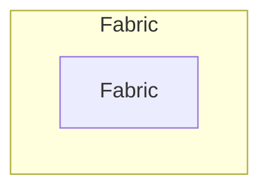

# Fabrics

ACI fabric represents the physical and logical underlay that hosts
one or more tenants and their policies.
It encompasses pods, switches, interfaces, domains,
and VLAN resources that collectively provide the infrastructure on
which tenant constructs operate.

## Fabric

A *Fabric* represents a single ACI deployment containing Pods, Nodes,
and policy objects.
One Fabric can host multiple Tenants.

The *ACIFabric* model has the following fields:

*Required fields*:

- **Name**: the ACI Fabric name.
- **Fabric ID**: numeric identifier used by features such as GOLF Auto‑RT.
    - Values: `1` - `128`
- **Infrastructure VLAN ID**: fabric-wide infrastructure VLAN.
    - Values: `1` - `4094`

*Optional fields*:

- **Description**: a description of the Fabric.
- **Infrastructure VLAN**: reference to a NetBox VLAN documenting the same VLAN ID.
- **GIPo pool**: reference to a NetBox Prefix representing the fabric-wide IPv4 multicast pool (e.g., 225.0.0.0/15).
- **NetBox tenant**: association to a NetBox Tenant.
- **Comments**: a text field for notes.
- **Tags**: a list of NetBox tags.
