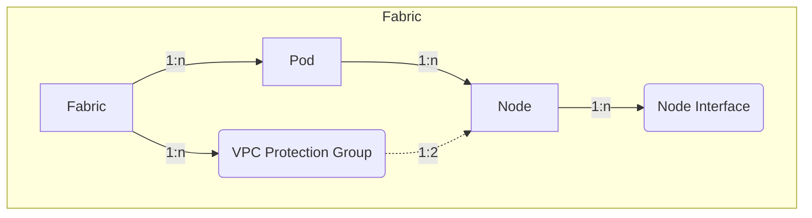

# Fabrics

An ACI Fabric represents the physical and logical underlay that hosts
one or more tenants and their policies.
It encompasses pods, nodes, interfaces, domains, and VLAN resources
that collectively provide the infrastructure on which tenant
constructs operate.

```mermaid
flowchart TD
  FAB[Fabric]
  POD[Pod]
  NODE[Node]
  NIF(Node Interface)
  VPG(VPC Protection Group)

  %% Fabric topology
  subgraph graphFAB [Fabric]
        FAB -->|1:n| POD
        POD -->|1:n| NODE
        NODE -->|1:n| NIF
        FAB -->|1:n| VPG
        VPG -.->|1:2| NODE
  end
```

## Fabric

A *Fabric* represents a single ACI deployment containing Pods, Nodes,
and fabric-level policy objects.
A Fabric can host multiple Tenants.

The *ACIFabric* model has the following fields:

*Required fields*:

- **Name**: the ACI Fabric name.
- **Fabric ID**: numeric identifier configured during APIC fabric setup.
    - Values: `1`-`128`
    - Distinct from the Multi-Site **Site ID**; not globally unique.
- **Infrastructure VLAN ID**: fabric-wide infrastructure VLAN used for
  APIC-to-switch communication.
    - Values: `1`-`4094`

*Optional fields*:

- **Description**: a description of the Fabric.
- **Infrastructure VLAN**: reference to a NetBox VLAN documenting the
  same VLAN ID.
- **GIPo pool**: reference to a NetBox Prefix representing the
  fabric-wide multicast (GIPo) pool (for example, `225.0.0.0/15`).
- **NetBox tenant**: association to a NetBox Tenant.
- **Comments**: a text field for notes (Markdown supported).
- **Tags**: a list of NetBox tags.

## Pod

An *ACI Pod* groups a set of leaf and spine nodes within a Fabric.
Pods provide a way to scale the fabric by grouping nodes into separate
domains while maintaining a unified management plane.
Each Pod within a Fabric must have a unique identifier and is assigned
a TEP pool for internal addressing.

The *ACIPod* model has the following fields:

*Required fields*:

- **Name**: the Pod name.
- **ACI Fabric**: reference to the related ACIFabric.
- **Pod ID**: unique numeric identifier within the Fabric.
    - Values: `1`-`255`

*Optional fields*:

- **Name alias**: an optional alias for the Pod name.
- **Description**: a description of the Pod.
- **TEP Pool**: reference to a NetBox Prefix representing the
  pod-wide IPv4 Tunnel Endpoint (TEP) pool.
    - Recommended: a dedicated unicast IPv4 prefix sized appropriately
      for the expected scale
      (commonly `/16`; smaller pools may be supported depending on
      APIC release and fabric scale).
- **NetBox tenant**: association to a NetBox Tenant.
- **Comments**: a text field for notes (Markdown supported).
- **Tags**: a list of NetBox tags.

## Node

An *ACI Node* represents a single managed element inside a Pod.
Most commonly a **leaf** or **spine** switch, and an **APIC**
controller.
Nodes are the building blocks of the fabric topology and are referenced by
their Node ID, which APIC assigns fabric-wide rather than per Pod. Two Nodes
in different Pods of the same Fabric cannot share a Node ID.

In NetBox, an ACI Node is primarily a **documentation and association
object**:

- It anchors the Node to an **ACI Pod** (and therefore to a Fabric).
- It optionally maps the Node to a **NetBox object** (typically a
  `dcim.Device`, and in some lab/virtual setups a
  `virtualization.VirtualMachine`).
- It can document the Node’s **role**, **deployment type**, and
  (optionally) the assigned **TEP IP** used for tunnel endpoints
  within the Pod.

The *ACINode* model has the following fields:

*Required fields*:

- **Name**: the Node name.
- **ACI Pod**: reference to the related ACIPod.
- **Node ID**: numeric identifier of the node within the Fabric.
    - Values: `1`-`100` (APIC), `101`-`4000` (Leaf/Spine)

*Optional fields*:

- **Name alias**: an optional alias for the Node name.
- **Description**: a description of the Node.
- **Node object type / Node object**: optional mapping to a NetBox object.
    - Supported object types are limited (**Device** or
      **Virtual Machine**).
    - If an **Object Type** is selected, the referenced **Object** must
      be set as well.
    - The referenced object must match the Pod’s **scope** (for example,
      Site/Region/Group or Location hierarchy)
- **Role**: functional role of the node in the topology.
    - Values: **Leaf**, **Spine**, **APIC**
- **Node Type**: documents the deployment type of the node.
    - Examples: virtual leaf, remote leaf (WAN), tier‑2 leaf
- **TEP IP Address**: optional reference to a NetBox IPAddress
  documenting the node’s Tunnel Endpoint (TEP).
    - The IP must be inside the Pod’s **TEP Pool** prefix.
    - The IP’s **VRF** must match the TEP Pool’s VRF (if applicable).
    - The host mask length must match the pool mask length.
- **NetBox tenant**: association to a NetBox Tenant.
- **Comments**: a text field for notes (Markdown supported).
- **Tags**: a list of NetBox tags.

## Node Interface

An *ACI Node Interface* identifies a physical interface on an ACI Node by
its module, port, and an optional breakout sub port. It is a NetBox
normalization of that interface identity, shared by the interface-policy
source models and the access paths that consume it. It does not directly
represent an APIC managed object, though its coordinate shape corresponds
to the naming properties `infraPortConfig` uses. Unlike most ACI policy
objects, it carries no name of its own. Its identity is
structural, the ACI Node plus its coordinates. It can optionally link the
NetBox interface it corresponds to for documentation and navigation, but
the coordinates, not the NetBox interface, are authoritative.

A sub port of `0` means the interface has no breakout sub port, the same
convention APIC uses on `infraPortConfig` itself. Because of that, the field
is never blank. Its detail view renders a `0` sub port as an empty
placeholder rather than the digit, so the page reads as "no sub port"
instead of a confusing zero.

The plugin names the first coordinate `module`, following NX-OS and NetBox
terminology for a line card slot. The APIC MIM calls the same attribute
`card`. This is a deliberate naming difference: `ACINodeInterface` is a
NetBox normalization of the interface identity, not a one-to-one mapping of
the managed object, so its fields read naturally to a NetBox user.

| Plugin field | `infraPortConfig` attribute |
|---|---|
| `module` | `card` |
| `port` | `port` |
| `sub_port` | `subPort` |

The *ACINodeInterface* model has the following fields:

*Required fields*:

- **ACI Node**: a reference to the parent `ACINode`.
- **Module**: the module (slot) number of the interface.
    - Values: `1`-`255`
    - Default: `1`
- **Port**: the port number of the interface.
    - Values: `1`-`127`
- **Sub port**: the breakout sub port number.
    - Values: `0`-`64`
    - Default: `0` (none)

*Optional fields*:

- **NetBox Interface**: a one-to-one reference to a NetBox `Interface`
  backing this Node Interface.
- **Description**: a description of the Node Interface.
- **NetBox tenant**: association to a NetBox Tenant.
- **Comments**: a text field for additional notes.
- **Tags**: a list of NetBox tags.

*Validation rules*:

- The ACI Node must have the Leaf role.
- When set, the NetBox Interface's device must match the ACI Node's assigned
  device.
- When set, the NetBox Interface's type must be connectable, ruling out
  virtual, LAG, bridge, and wireless interface types.
- The `(aci_node, module, port, sub_port)` combination must be unique.

The identity and naming are role-neutral by design so a later release can
add Spine support without renaming the table, migrating foreign keys, or
renaming REST and GraphQL resources, though this release validates Leaf
Nodes only, per the rule above.

Every Node Interface exposes a read-only `interface_token`, the coordinates
rendered the way APIC itself displays them, for example `eth1/17` or
`eth1/17/1` once a sub port is set. It is a derived value, computed from the
coordinates on every read, and it is never accepted as input on create or
update: posting or patching a token has no effect on the stored coordinates.

The Node Interface documents only the front panel and breakout coordinates of
a leaf-facing port. FEX identity, host interfaces, and external paths are
deferred entirely to a dedicated FEX feature, and breakout port configuration
itself is deferred the same way, since the sub port coordinate only reserves
space for it.

## VPC Protection Group

An *ACI VPC Protection Group* represents an ACI VPC Explicit Protection
Group (`fabricExplicitGEp`), pairing two Leaf Nodes into a virtual port
channel domain identified by a logical pair ID. A later release's virtual
port channel access paths require the two Leaf Nodes of the path to form
exactly one Protection Group.

The *ACIVPCProtectionGroup* model has the following fields:

*Required fields*:

- **Name**: the Protection Group name in the ACI.
- **ACI Fabric**: a reference to the `ACIFabric` model.
- **Logical pair ID**: identifier of the virtual port channel domain formed
  by the node pair.
    - Values: `1`-`1000`
- **ACI Node A**: the first ACI Leaf Node of the Protection Group.
- **ACI Node B**: the second ACI Leaf Node of the Protection Group.

*Optional fields*:

- **Name alias**: a name alias in the ACI for the Protection Group.
- **Description**: a description of the Protection Group.
- **NetBox Tenant**: a reference to the NetBox tenant model.
- **Comments**: a text field for additional notes.
- **Tags**: a list of NetBox tags.

*Validation rules*:

- ACI Node A and ACI Node B must be different Nodes.
- Both Nodes must have the Leaf role.
- Both Nodes must belong to the same ACI Fabric as the Protection Group.
- Both Nodes must belong to the same ACI Pod.
- Neither Node may already be a member of another Protection Group.
- The `(aci_fabric, name)` combination must be unique.
- The `(aci_fabric, logical_pair_id)` combination must be unique.
- The Node pair is unique regardless of which Node is stored as A or which
  as B.

The Protection Group exposes an `ordered_nodes` property that returns the
pair sorted by Node ID rather than by which Node happens to be stored as A
or B. A later release's access path rendering relies on this ordering, not
on database column order, to build the ACI target distinguished name.

Once two Nodes form a Protection Group, neither one can change its ACI Pod
or drop the Leaf role on its own. A Pod move would either split the pair
across Pods or leave the Group scoped to a Fabric one member no longer
belongs to, and a role change would leave a non-leaf in a construct that
only makes sense for leaves. The Protection Group has to be removed first. A
Node that carries only Node Interfaces, with no Protection Group
membership, is not held to this restriction and can still change role
freely. A later release's effective configuration resolver surfaces a stale
role assignment as a status on the affected interfaces rather than blocking
the change at save time.

The VPC instance policy relation and non-explicit VPC pair modes are not
modeled. The plugin also does not validate leaf hardware compatibility
across a Protection Group's pair. Cisco recommends pairing compatible leaf
generations, and operators should follow that guidance, since the plugin
will not warn about a mismatch.

The Leaf Interface Policy Groups that these Node Interfaces are eventually
bound to are documented in [Access Policies](access_policies.md).
