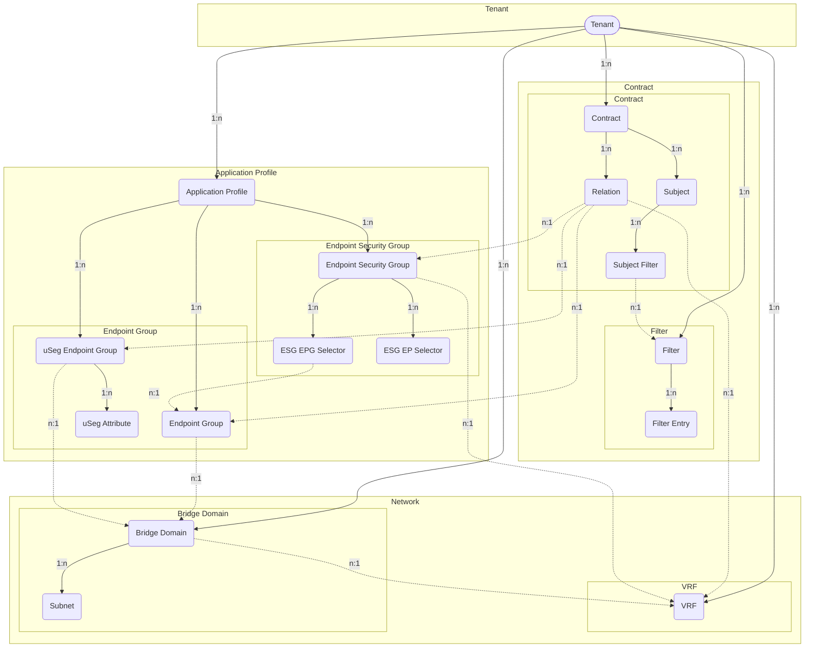

# Tenants

ACI fabric manages one or more *Tenants* based on the tenant portion of the
hierarchical management information tree (MIT).

## Tenant

A *Tenant* in the ACI policy model represents a container for application
policies with domain-based access control.
Tenants can be modeled after customers, organizations, domains, or used to
group policies.

The *ACITenant* model has the following fields:

*Required fields*:

- **Name**: represent the Tenant name in the ACI.

*Optional fields*:

- **Name alias**: a name alias in the ACI.
- **Description**: a description of the ACI Tenant.
- **NetBox Tenant**: an assignment to the NetBox tenant model.
- **Comments**: a text field for additional notes.
- **Tags**: a list of NetBox tags.

## Application Profile

An *Application Profile* contains *Endpoint Groups* (EPGs) and may be modeled
after applications, stages or domains.

The *ACIAppProfile* model has the following fields:

*Required fields*:

- **Name**: represent the Application Profile name in the ACI.
- **ACI Tenant**: a reference to the `ACITenant` model.

*Optional fields*:

- **Name alias**: a name alias in the ACI for the Application Profile.
- **Description**: a description of the Application Profile.
- **NetBox Tenant**: a reference to the NetBox tenant model.
- **Comments**: a text field for additional notes.
- **Tags**: a list of NetBox tags.

## VRF

A *VRF (virtual routing and forwarding)* instance defines a unique layer 3
forwarding, address and application policy domain for a *Tenant*.
The layer 3 domain must have unique IP addresses.
A *Tenant* can contain multiple VRFs.
Bridge Domains are associated with a VRF.

The *ACIVRF* model has the following fields:

*Required fields*:

- **Name**: represent the VRF name in the ACI.
- **ACI Tenant**: a reference to the `ACITenant` model.

*Optional fields*:

- **Name alias**: a name alias in the ACI for the VRF.
- **Description**: a description of the VRF.
- **NetBox Tenant**: a reference to the NetBox tenant model.
- **NetBox VRF**: a reference to the NetBox vrf model.
- **BD enforcement enabled**: a boolean field, whether endpoints can ping other
  bridge domain gateways.
    - Default: `false`
- **DNS labels**: a comma-separated list of DNS labels.
- **IP data plane learning enabled**: a boolean field representing whether IP
  data plane learning is enabled for the VRF.
    - Default: `true`
- **PC enforcement direction**: Direction of policy control enforcement.
    - Values: `ingress` (ingress), `egress` (egress)
    - Default: `ingress`
- **PC enforcement preference**: Preference of policy control enforcement.
    - Values: `enforced` (enforced), `unenforced` (unenforced)
    - Default: `enforced`
- **PIM IPv4 enabled**: a boolean field, whether IPv4 multicast is enabled.
    - Default: `false`
- **PIM IPv6 enabled**: a boolean field, whether IPv6 multicast is enabled.
    - Default: `false`
- **Preferred group enabled**: a boolean field, if the preferred group feature
  is enabled for the VRF.
    - Default: `false`
- **Comments**: a text field for additional notes.
- **Tags**: a list of NetBox tags.

## Bridge Domain

A *Bridge Domain* represents layer 2 forwarding and flood domain defining a
unique MAC address space.
Each Bridge Domain must be linked to a VRF instance.
One or more Subnets are associated with a Bridge Domain.

The *ACIBridgeDomain* model has the following fields:

*Required fields*:

- **Name**: represent the Bridge Domain name in the ACI.
- **ACI Tenant**: a reference to the `ACITenant` model.
- **ACI VRF**: a reference to the `ACIVRF` model.

*Optional fields*:

- **Name alias**: a name alias in the ACI for the Bridge Domain.
- **Description**: a description of the Bridge Domain.
- **NetBox Tenant**: a reference to the NetBox tenant model.
- **Advertise host routes enabled**: a boolean field, whether associated
  endpoints are advertised as host routes (/32 prefixes) out of the L3Outs.
    - Default: `false`
- **ARP flooding enabled**: a boolean field representing the state, whether
  Address Resolution Protocol (ARP) is flooded within the Bridge Domain.
    - Default: `false`
- **Clear remote mac entries enabled**: a boolean field, whether MAC endpoint
  entries should be deleted on remote leaves, when endpoints are removed from
  the local leaf.
    - Default: `false`
- **DHCP labels**: a comma-separated list of DHCP labels.
- **EP move detection enabled**: a boolean field documenting the state of
  endpoint move detection based on Gratuitous ARP (GARP).
    - Default: `false`
- **IGMP interface policy name**: the name of the IGMP interface policy.
- **IGMP snooping policy name**: the name of the IGMP snooping policy.
- **IP data plane learning enabled**: a boolean field representing whether IP
  data plane learning is enabled for the Bridge Domain.
    - Default: `true`
- **Limit IP learn enabled**: a boolean field, if IP learning is limited to the
  Bridge Domain's subnets.
    - Default: `true`
- **MAC address**: the MAC address of the Bridge Domain's gateway.
    - Default: `00:22:BD:F8:19:FF`
- **Multi destination flooding**: forwarding method for layer 2 multicast,
  broadcast and link layer traffic.
    - Values: `bd-flood` (Bridge Domain flood),
      `encap-flood` (encapsulation flood), `drop` (drop)
    - Default: `bd-flood`
- **PIM IPv4 enabled**: a boolean field, whether IPv4 multicast is enabled.
    - Default: `false`
- **PIM IPv4 destination filter**: the name of the PIM IPv4 destination filter.
- **PIM IPv4 source filter**: the name of the PIM IPv4 source filter.
- **PIM IPv6 enabled**: a boolean field, whether IPv6 multicast is enabled.
    - Default: `false`
- **Unicast routing enabled**: a boolean field, whether unicast routing is.
  enabled.
    - Default: `true`
- **Unknown IPv4 multicast**: defines the IPv4 unknown multicast forwarding
  method.
    - Values: `flood` (flood), `opt-flood` (optimized flood)
    - Default: `flood`
- **Unknown IPv6 multicast**: defines the IPv6 unknown multicast forwarding
  method.
    - Values: `flood` (flood), `opt-flood` (optimized flood)
    - Default: `flood`
- **Virtual MAC address**: the virtual MAC address of the Bridge Domain / SVI
  used when the Bridge Domain is extended to multiple sites using L2Outs.
- **Comments**: a text field for additional notes.
- **Tags**: a list of NetBox tags.

## Bridge Domain Subnet

A *Bridge Domain Subnet* is an anycast gateway IP address of the Bridge Domain.
The Subnet must be linked to a Bridge Domain instance.
One or more Subnets can be associated with a Bridge Domain, but only one Subnet
can be preferred.

The *ACIBridgeDomainSubnet* model has the following fields:

*Required fields*:

- **Name**: represent the Bridge Domain name in the ACI.
- **ACI Bridge Domain**: a reference to the `ACIBridgeDomain` model.
- **Gateway IP Address**: the gateway IP address of the Bridge Domain
  (referencing the NetBox IP address).

*Optional fields*:

- **Name alias**: a name alias in the ACI for the Bridge Domain Subnet.
- **Description**: a description of the Bridge Domain Subnet.
- **NetBox Tenant**: a reference to the NetBox tenant model.
- **Advertised externally enabled**: a boolean field, whether the subnet is
  advertised to the outside to any associated L3Outs (public scope).
    - Default: `false`
- **IGMP querier enabled**: a boolean field specifying whether the gateway
  IP address is treated as an IGMP querier source IP.
    - Default: `false`
- **IP data plane learning enabled**: a boolean field representing whether
  IP data plane learning is enabled for the Bridge Domain Subnet.
    - Default: `true`
- **No default SVI gateway**: a boolean field, if the default gateway
  functionality of the address is removed.
    - Default: `false`
- **ND RA enabled**: a boolean field, whether the gateway IP is treated as an
  IPv6 Neighbor Discovery Router Advertisement prefix.
    - Default: `true`
- **ND RA prefix policy name**: the name of the Neighbor Discovery Router
  Advertisement prefix policy.
- **Preferred IP address enabled**: a boolean field, if the gateway IP address
  is the preferred (primary) IP gateway of the Bridge Domain.
    - Default: `false`
- **Shared enabled**: a boolean field, if endpoints can communicate only within
  the same (*disabled*) or shared VRFs (*enabled*) in the ACI fabric
  (inter-VRF route leaking).
    - Default: `false`
- **Virtual IP enabled**: a boolean field determining if the gateway is a
  virtual IP address (used for stretched Bridge Domains to multiple sites).
    - Default: `false`
- **Comments**: a text field for additional notes.
- **Tags**: a list of NetBox tags.

## Endpoint Group

An *Endpoint Group* (EPG) is a named collection of endpoints (network-connected
devices).
The EPG needs to be contained in an Application Profile and be linked to a
Bridge Domain.

The *ACIEndpointGroup* model has the following fields:

*Required fields*:

- **Name**: represent the Endpoint Group name in the ACI.
- **ACI Application Profile**: containing the Endpoint Group.
- **ACI Bridge Domain**: linking the associated Bridge Domain.

*Optional fields*:

- **Name alias**: a name alias in the ACI for the Endpoint Group.
- **Description**: a description of the Endpoint Group.
- **NetBox Tenant**: a reference to the NetBox tenant model.
- **Admin shutdown**: a boolean field, whether the EPG is in shutdown mode,
  removing all policy configuration from all switches.
    - Default: `false`
- **Custom QoS policy name**: the name of the custom Quality of Service (Qos)
  policy name associated with the EPG.
- **Flood in encapsulation enabled**: a boolean field representing whether the
  flooding traffic is limited to the encapsulation of the EPG.
    - Default: `false`
- **Intra-EPG isolation enabled**: a boolean field, whether the communication
  between endpoints in the EPG is prevented.
    - Default: `false`
- **QoS class**: represents the assignment of the ACI Quality of Service (QoS)
  level for traffic sourced in the EPG.
    - Values: `unspecified` (unspecified), `level1` (level 1),
      `level2` (level 2), `level3` (level 3), `level4` (level 4),
      `level5` (level 5), `level6` (level 6)
    - Default: `unspecified`
- **Preferred group member enabled**: a boolean field, if the EPG is a member
  of the preferred group and allows communication without contracts.
    - Default: `false`
- **Proxy-ARP enabled**: a boolean field, whether proxy ARP is enabled for the
  EPG.
    - Default: `false`
- **Comments**: a text field for additional notes.
- **Tags**: a list of NetBox tags.

## uSeg Endpoint Group

An *uSeg Endpoint Group* (uSeg EPG) is a named collection of endpoints
(network-connected devices) based on attributes for micro segmentation (uSeg).
The EPG needs to be contained in an Application Profile and be linked to a
Bridge Domain.
uSeg Endpoint Groups consist of one or more associated
*uSeg Network Attributes* defining the attributes segmenting one or more
endpoints.

The *ACIUSegEndpointGroup* model has the following fields:

*Required fields*:

- **Name**: represents the uSeg Endpoint Group name in the ACI.
- **ACI Application Profile**: indicates the Application Profile that contains
  this uSeg Endpoint Group.
- **ACI Bridge Domain**: links the associated Bridge Domain.

*Optional fields*:

- **Name alias**: a name alias in the ACI for the uSeg Endpoint Group.
- **Description**: a description of the uSeg Endpoint Group.
- **NetBox Tenant**: a reference to the NetBox tenant model.
- **Admin shutdown**: a boolean field, whether the uSeg EPG is in shutdown
  mode, removing all policy configuration from all switches.
    - Default: `false`
- **Custom QoS policy name**: the name of the custom Quality of Service (Qos)
  policy name associated with the uSeg EPG.
- **Flood in encapsulation enabled**: a boolean field representing whether the
  flooding traffic is limited to the encapsulation of the uSeg EPG.
    - Default: `false`
- **Intra-EPG isolation enabled**: a boolean field, whether the communication
  between endpoints in the uSeg EPG is prevented.
    - Default: `false`
- **Match operator**: specifies the match operation for the referenced uSeg
  attributes.
    - Values: `any` (any), `all` (all),
    - Default: `any`
- **QoS class**: represents the assignment of the ACI Quality of Service (QoS)
  level for traffic sourced in the uSeg EPG.
    - Values: `unspecified` (unspecified), `level1` (level 1),
      `level2` (level 2), `level3` (level 3), `level4` (level 4),
      `level5` (level 5), `level6` (level 6)
    - Default: `unspecified`
- **Preferred group member enabled**: a boolean field, if the uSeg EPG is a
  member of the preferred group and allows communication without contracts.
    - Default: `false`
- **Comments**: a text field for additional notes.
- **Tags**: a list of NetBox tags.

## uSeg Network Attribute

The *ACIUSegNetworkAttribute* model represents a network attribute associated
with a uSeg Endpoint Group.
This attribute is used to segment endpoints based on network parameters — such
as IP address, MAC address or network prefix information.

The *ACIUSegNetworkAttribute* model has the following fields:

*Required fields*:

- **Name**: represents the uSeg Network Attribute name in the ACI.
- **ACI uSeg Endpoint Group**: a reference to the uSeg Endpoint Group
  associated with this network attribute.

*Optional fields*:

- **Name alias**: an alternate name for the uSeg Network Attribute.
- **Description**: a description of the uSeg Network Attribute.
- **NetBox Tenant**: a reference to the NetBox tenant model.
- **Attribute Object Type**: defines the type of the associated network object
  (e.g., *IPAddress*, *MACAddress*, *Prefix*) in the form `app.model`.
- **Attribute Object ID**: represents the (database) identifier for the
  associated object.
- **Attribute Object**: references the specific network object to which this
  attribute applies.
- **Use EPG Subnet**: a boolean indicating whether the uSeg Endpoint Group's
  subnet should be used.
    - Default: `false`
- **Type**: specifies the ACI uSeg category of the network attribute
  (read-only).
- **Comments**: a text field for additional notes.
- **Tags**: a list of NetBox tags.

## Endpoint Security Group

An *Endpoint Security Group* (ESG) is a named set of endpoints
(network-connected devices) that applies security policies based on specified
attributes.
The ESG must be contained in an Application Profile and be linked to a VRF.

The *ACIEndpointSecurityGroup* model has the following fields:

*Required fields*:

- **Name**: represents the Endpoint Security Group name in the ACI.
- **ACI Application Profile**: containing the Endpoint Security Group.
- **ACI VRF**: a reference to the associated VRF.

*Optional fields*:

- **Name alias**: a name alias in the ACI for the Endpoint Security Group.
- **Description**: a description of the Endpoint Group.
- **NetBox Tenant**: a reference to the NetBox tenant model.
- **Admin shutdown**: a boolean field indicating whether the ESG is in shutdown
  mode, removing all policy configuration from all switches.
    - Default: `false`
- **Intra-ESG isolation enabled**: a boolean field indicating whether the
  communication between endpoints in the ESG is prevented.
    - Default: `false`
- **Preferred group member enabled**: a boolean field indicating whether the
  ESG is in the preferred group, allowing communication without contracts.
    - Default: `false`
- **Comments**: a text field for additional notes.
- **Tags**: a list of NetBox tags.

## ESG Endpoint Group (EPG) Selector

The *ACIEsgEndpointGroupSelector* model represents an Endpoint Group selector
associated with an Endpoint Security Group.
This selector is used to match Endpoint Groups based on the specified
Endpoint Groups.

The *ACIEsgEndpointGroupSelector* model has the following fields:

*Required fields*:

- **Name**: represents the ESG Endpoint Group Selector name in the ACI.
- **ACI Endpoint Security Group**: a reference to the Endpoint Security Group
  associated with this endpoint group selector.

*Optional fields*:

- **Name alias**: an alternate name for the ESG Endpoint Group Selector.
- **Description**: a description of the ESG Endpoint Group Selector.
- **NetBox Tenant**: a reference to the NetBox tenant model.
- **ACI EPG Object Type**: defines the type of the associated Endpoint Group
  object (e.g., *ACIEndpointGroup*, *ACIUSegEndpointGroup*) in the form
  `app.model`.
- **ACI EPG Object ID**: represents the (database) identifier for the
  associated object.
- **ACI EPG Object**: references the specific ACI Endpoint Group object to
  which this selector applies.
- **Comments**: a text field for additional notes.
- **Tags**: a list of NetBox tags.

## ESG Endpoint Selector

The *ACIEsgEndpointSelector* model represents an endpoint selector associated
with an Endpoint Security Group.
This selector is used to match specified endpoints based on network
parameters — such as IP addresses or network prefix information.

The *ACIEsgEndpointSelector* model has the following fields:

*Required fields*:

- **Name**: represents the ESG Endpoint Selector name in the ACI.
- **ACI Endpoint Security Group**: a reference to the Endpoint Security Group
  associated with this endpoint selector.

*Optional fields*:

- **Name alias**: an alternate name for the ESG Endpoint Selector.
- **Description**: a description of the ESG Endpoint Selector.
- **NetBox Tenant**: a reference to the NetBox tenant model.
- **Endpoint Object Type**: defines the type of the associated endpoint object
  (e.g., *IPAddress*, *Prefix*) in the form `app.model`.
- **Endpoint Object ID**: represents the (database) identifier for the
  associated object.
- **Endpoint Object**: references the specific network object to which this
  selector applies.
- **Comments**: a text field for additional notes.
- **Tags**: a list of NetBox tags.

## Contract Filter

A *Contract Filter* in the ACI policy model represents a filter that contains
multiple filter entries defining the type of traffic that is allowed or denied.
Each Contract Filter is associated with a *Tenant*.

The *ACIContractFilter* model has the following fields:

*Required fields*:

- **Name**: represent the Contract Filter name in the ACI.
- **ACI Tenant**: a reference to the `ACITenant` model, associating the filter
  with a specific tenant.

*Optional fields*:

- **Name Alias**: an alias for the name of the filter in the ACI.
- **Description**: a brief description of the filter.
- **NetBox Tenant**: a reference to the NetBox tenant model, linking the filter
  to a NetBox tenant.
- **Comments**: a text field for additional notes or comments.
- **Tags**: a list of NetBox tags.

## Contract Filter Entry

The *ACIContractFilterEntry* represents individual entries within a contract
filter, specifying the types of traffic that either pass through or are blocked
by the defined filter rules.
One or more filters can be linked to the `ACIContractFilter` model.

The *ACIContractFilterEntry* model has the following fields:

*Required fields*:

- **Name**: the name of the filter entry in the Contract Filter.
- **Contract Filter**: a reference to the `ACIContractFilter` model,
  associating the entry with a specific contract filter.

*Optional fields*:

- **Name Alias**: an alias for the name of the filter entry.
- **Description**: a brief description of the filter entry.
- **ARP OPC**: specifies the ARP open peripheral codes for *Ethernet Type*
  `arp` (ARP).
    - Values: `unspecified` (unspecified), `req` (ARP request),
      `reply` (ARP reply)
    - Default: `unspecified`
- **Destination from-port**: sets the start of the filter destination port
  range, in case for *IP Protocol* `tcp` (TCP) or `udp` (UDP).
    - Values: `unspecified` (unspecified), `dns` (DNS), `ftpData` (FTP Data),
      `http` (HTTP), `https` (HTTPS), `pop3` (POP3), `rtsp` (RTSP),
      `smtp` (SMTP), `ssh` (SSH) or in range of `0`–`65535`
    - Default: `unspecified`
- **Destination to-port**: sets the end of the filter destination port range,
  in case for *IP Protocol* `tcp` (TCP) or `udp` (UDP).
    - Values: `unspecified` (unspecified), `dns` (DNS), `ftpData` (FTP Data),
      `http` (HTTP), `https` (HTTPS), `pop3` (POP3), `rtsp` (RTSP),
      `smtp` (SMTP), `ssh` (SSH) or in range of `0`–`65535`
    - Default: `unspecified`
- **Ethernet type**: declares the matching Ethernet type for the Filter Entry.
    - Values: `unspecified` (unspecified), `arp` (ARP), `fcoe` (FCOE),
      `ip` (IP), `ipv4` (IPv4), `ipv6` (IPv6), `mac_security` (MAC Security),
      `mpls_ucast` (MPLS Unicast), `trill` (Trill)
    - Default: `unspecified`
- **ICMP v4 type**: matches the specified ICMPv4 message type for *IP Protocol*
  `icmp` (ICMPv4).
    - Values: `unspecified` (unspecified),
      `dst-unreach` (destination unreachable), `echo` (echo request),
      `echo-rep` (echo reply), `src-quench` (source quench),
      `time-exceeded` (time exceeded)
    - Default: `unspecified`
- **ICMP v6 type**: matches the specified ICMPv6 message type for *IP Protocol*
  `icmpv6` (ICMPv6).
    - Values: `unspecified` (unspecified),
      `dst-unreach` (destination unreachable), `echo-req` (echo request),
      `echo-rep` (echo reply), `nbr-advert` (neighbor advertisement),
      `nbr-solicit` (neighbor solicitation), `time-exceeded` (time exceeded)
    - Default: `unspecified`
- **IP protocol**: specifies the layer 3 IP protocol type for *Ethernet Type*
  `ip` (IP).
    - Values: `unspecified` (unspecified), `egp` (EGP), `eigrp` (EIGRP),
      `icmp` (ICMPv4), `icmpv6` (ICMPv6), `igmp` (IGMP), `igp` (IGP),
      `l2tp` (L2TP), `ospfigp` (OSPF), `pim` (PIM), `tcp` (TCP), `udp` (UDP)
      or in range of `0`-`255`
    - Default: `unspecified`
- **Match DSCP**: matches the specific DSCP (Differentiated Services Code
  Point) value for *Ethernet Type* `ip` (IP).
    - Values: `unspecified`, `AF11`, `AF12`, `AF13`, `AF21`, `AF22`, `AF23`,
      `AF31`, `AF32`, `AF33`, `AF41`, `AF42`, `AF43`, `CS0`, `CS1`, `CS2`,
      `CS3`, `CS4`, `CS5`, `CS6`, `CS7`, `EF`, `VA`
    - Default: `unspecified`
- **Match only fragments enabled**: represents whether the filter rule
  matches only fragments with offset greater than 0 (all fragments except the
  first one).
    - Default: `false`
- **Source from-port**: sets the start of the filter source port range, in case
  for *IP Protocol* `tcp` (TCP) or `udp` (UDP).
    - Values: `unspecified` (unspecified), `dns` (DNS), `ftpData` (FTP Data),
      `http` (HTTP), `https` (HTTPS), `pop3` (POP3), `rtsp` (RTSP),
      `smtp` (SMTP), `ssh` (SSH) or in range of `0`–`65535`
    - Default: `unspecified`
- **Source to-port**: sets the end of the filter source port range, in case for
  *IP Protocol* `tcp` (TCP) or `udp` (UDP).
    - Values: `unspecified` (unspecified), `dns` (DNS), `ftpData` (FTP Data),
      `http` (HTTP), `https` (HTTPS), `pop3` (POP3), `rtsp` (RTSP),
      `smtp` (SMTP), `ssh` (SSH) or in range of `0`–`65535`
    - Default: `unspecified`
- **Stateful enabled**: allows TCP packets from provider to consumer only if
  the TCP flack ACK is set for *IP Protocol* `tcp` (TCP).
    - Default: `false`
- **TCP rules**: specifies a list of matching TCP flag values for *IP Protocol*
  `tcp` (TCP).
    - Values: `unspecified` (unspecified), `ack` (acknowledgement),
      `est` (established), `fin` (finish), `rst` (reset), `syn` (synchronize)
    - Default: `unspecified`
- **Comments**: A text field for additional notes or comments.
- **Tags**: a list of NetBox tags.

## Contract

A *Contract* defines a set of policies that govern how traffic is permitted or
denied between endpoints.
Contracts consist of one or more associated *Contract Subjects* that define the
exact *Contract Filters* for allowed or denied traffic.

Each Contract is associated with an *ACI Tenant* and is used to manage the
communication between *Consumers* and *Providers*.

The *ACIContract* model has the following fields:

*Required fields*:

- **Name**: represent the Contract name in the ACI.
- **ACI Tenant**: a reference to the `ACITenant` model, associating the
  contract with a specific tenant.

*Optional fields*:

- **Name Alias**: an alias for the name of the contract in the ACI.
- **Description**: a brief description of the contract.
- **NetBox Tenant**: a reference to the NetBox tenant model, linking the
  contract to a NetBox tenant.
- **QoS class**: specifies the priority handling, Quality of Service (QoS), for
  traffic between Consumer and Provider within the fabric.
    - Values: `unspecified` (unspecified), `level1` (level 1),
      `level2` (level 2), `level3` (level 3), `level4` (level 4),
      `level5` (level 5), `level6` (level 6)
    - Default: `unspecified`
- **Scope**: defines the extent within which the contract is applicable.
    - Values: `context` (VRF), `application-profile` (Application Profile),
      `tenant` (Tenant), `global` (Global).
    - Default: `context`
- **Target DSCP**: rewrites the DSCP (Differentiated Services Code Point) value
  of the incoming traffic to the specified value.
    - Values: `unspecified`, `AF11`, `AF12`, `AF13`, `AF21`, `AF22`, `AF23`,
      `AF31`, `AF32`, `AF33`, `AF41`, `AF42`, `AF43`, `CS0`, `CS1`, `CS2`,
      `CS3`, `CS4`, `CS5`, `CS6`, `CS7`, `EF`, `VA`
    - Default: `unspecified`
- **Comments**: a text field for additional notes or comments.
- **Tags**: a list of NetBox tags.

## Contract Relation

A *Contract Relation* links a *Contract* to specific ACI objects such as
*Endpoint Groups* (EPG) or *Virtual Routing and Forwarding* (VRF) instances.
A *Contract Relation* specifies the role of a given *Contract* for an
associated ACI object, either as a **Provider** or a **Consumer**.
Both the *Contract* and the associated ACI object must belong to the same
*ACI Tenant*.

The *ACIContractRelation* model has the following fields:

*Required fields*:

- **ACI Contract**: a reference to the related `ACIContract` model.
  This defines the Contract associated with the relation.
- **ACI Object Type**: the type of the target ACI object (e.g.,
  *Endpoint Group* or *VRF*) in the form `app.model`.
    - Values: `netbox_aci_plugin.aciendpointgroup` (Endpoint Group),
      `netbox_aci_plugin.acivrf` (VRF)
- **ACI Object ID**: represents the (database) identifier for the specific
  ACI object.

*Optional fields*:

- **Role**: specifies the role of the Contract for the associated ACI object.
    - Values: `prov` (Provider), `cons` (Consumer)
    - Default: `prov`
- **Comments**: a text field for additional notes or comments.
- **Tags**: a list of NetBox tags.

## Contract Subject

A *Contract Subject* defines how contract filters and service graph templates
are applied within a *Contract*.
Each Subject is associated with an *ACI Contract*.

The *ACIContractSubject* model has the following fields:

*Required fields*:

- **Name**: represent the Contract Subject name in the ACI.
- **ACI Contract**: a reference to the `ACIContract` model, associating the
  subject with a specific contract.

*Optional fields*:

- **Name Alias**: an alias for the name of the subject in the ACI.
- **Description**: a brief description of the subject.
- **NetBox Tenant**: a reference to the NetBox tenant model, linking the
  subject to a NetBox tenant.
- **Apply both directions enabled**: indicates whether the filter associated
  with the subject is applied in both directions
  (consumer-to-provider and provider-to-consumer).
    - Default: `true`
- **QoS class**: specifies the priority handling, Quality of Service (QoS), for
  traffic between Consumer and Provider within the fabric.
    - Values: `unspecified` (unspecified), `level1` (level 1),
      `level2` (level 2), `level3` (level 3), `level4` (level 4),
      `level5` (level 5), `level6` (level 6)
    - Default: `unspecified`
- **QoS class Consumer to Provider**: specifies the priority handling,
  Quality of Service (QoS), for traffic from Consumer to Provider within the
  fabric (for disabled `apply_both_directions_enabled`).
    - Values: `unspecified` (unspecified), `level1` (level 1),
      `level2` (level 2), `level3` (level 3), `level4` (level 4),
      `level5` (level 5), `level6` (level 6)
      - Default: `unspecified`
- **QoS class Provider to Consumer**: specifies the priority handling,
  Quality of Service (QoS), for traffic from Provider to Consumer within the
  fabric (for disabled `apply_both_directions_enabled`).
    - Values: `unspecified` (unspecified), `level1` (level 1),
      `level2` (level 2), `level3` (level 3), `level4` (level 4),
      `level5` (level 5), `level6` (level 6)
    - Default: `unspecified`
- **Reverse filter ports enabled**: Indicates whether the source and
  destination ports of the associated filter within the subject are reversed
  for the return traffic.
    - Default: `true`
- **Service Graph name**: the name of the Service Graph Template
  associated with the subject.
- **Service Graph name Consumer to Provider**: the name of the Service Graph
  Template associated with the subject for traffic from Consumer to
  Provider (for disabled `apply_both_directions_enabled`).
- **Service Graph name Provider to Consumer**: the name of the Service Graph
  Template associated with the subject for traffic from Provider to
  Consumer (for disabled `apply_both_directions_enabled`).
- **Target DSCP**: rewrites the DSCP (Differentiated Services Code Point) value
  of the incoming traffic to the specified value.
    - Values: `unspecified`, `AF11`, `AF12`, `AF13`, `AF21`, `AF22`, `AF23`,
      `AF31`, `AF32`, `AF33`, `AF41`, `AF42`, `AF43`, `CS0`, `CS1`, `CS2`,
      `CS3`, `CS4`, `CS5`, `CS6`, `CS7`, `EF`, `VA`
    - Default: `unspecified`
- **Target DSCP Consumer to Provider**: rewrites the DSCP (Differentiated
  Services Code Point) value of the incoming traffic to the specified value
  for traffic from Consumer to Provider within the fabric
  (for disabled `apply_both_directions_enabled`).
    - Values: `unspecified`, `AF11`, `AF12`, `AF13`, `AF21`, `AF22`, `AF23`,
      `AF31`, `AF32`, `AF33`, `AF41`, `AF42`, `AF43`, `CS0`, `CS1`, `CS2`,
      `CS3`, `CS4`, `CS5`, `CS6`, `CS7`, `EF`, `VA`
    - Default: `unspecified`
- **Target DSCP Provider to Consumer**: rewrites the DSCP (Differentiated
  Services Code Point) value of the incoming traffic to the specified value
  for traffic from Provider to Consumer within the fabric
  (for disabled `apply_both_directions_enabled`).
    - Values: `unspecified`, `AF11`, `AF12`, `AF13`, `AF21`, `AF22`, `AF23`,
      `AF31`, `AF32`, `AF33`, `AF41`, `AF42`, `AF43`, `CS0`, `CS1`, `CS2`,
      `CS3`, `CS4`, `CS5`, `CS6`, `CS7`, `EF`, `VA`
    - Default: `unspecified`
- **Comments**: a text field for additional notes or comments.
- **Tags**: a list of NetBox tags.

## Contract Subject Filter

The *Contract Subject Filter* defines the association of a *Contract Filter*
with a *Contract Subject*.
It specifies how the filter is applied to traffic between consumer and
provider endpoints.

The *ACIContractSubjectFilter* model has the following fields:

*Required fields*:

- **ACI Contract Filter**: links to the associated `ACIContractFilter` model.
- **ACI Contract Subject**: ties the filter to the `ACIContractSubject` model,
  associating the given filter with a specific ACI Contract Subject.

*Optional fields*:

- **Action**: determines whether the traffic is permitted or denied.
    - Values: `permit`, `deny`
    - Default: `permit`
- **Apply direction**: specifies the direction to apply the filter.
    - Values: `both` (both directions), `ctp` (consumer to provider),
      `ptc` (provider to consumer)
    - Default: `both`
- **Log enabled**: indicates whether logging is enabled for the applied filter.
    - Default: `false`
- **Policy Compression enabled**: specifies whether policy-based compression
  for filtering is enabled.
  This reduces the number of rules in the TCAM.
    - Default: `false`
- **Priority**: sets the priority of deny actions.
  The value is only valid for *action* `deny`.
    - Values: `default` (default level), `level1` (level 1),
      `level2` (level 2), `level3` (level 3)
    - Default: `default`
- **Comments**: a text field for additional notes or comments.
- **Tags**: a list of NetBox tags.
