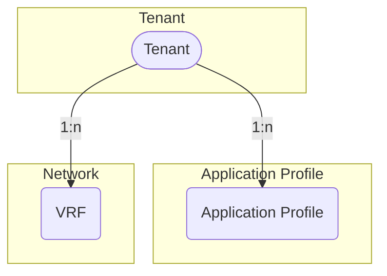

# Tenants

An ACI fabric manages one or more *tenants* based on the tenant portion of the hierarchical management information tree (MIT).

## Tenant

A *tenant* in the ACI policy model represents a container for application policies with domain-based access control. Tenants can be modeled after customers, organizations, domains, or used to group policies.

The *ACITenant* model has the following fields:

*Required fields*:

- **Name**: represent the tenant name in the ACI

*Optional fields*:

- **Alias**: an alias in the ACI
- **Description**: a description of the ACI tenant
- **NetBox Tenant**: an assignment to the NetBox tenant model
- **Comments**: a text field for additional notes
- **Tags**: a list of NetBox tags

## Application Profile

An *application profile* contains *endpoint groups* (EPGs) and may be modeled after applications, stages or domains.

The *ACIAppProfile* model has the following fields:

*Required fields*:

- **Name**: represent the application profile name in the ACI
- **ACI Tenant**: a reference to the ACITenant model.

*Optional fields*:

- **Alias**: an alias in the ACI for the application profile
- **Description**: a description of the application profile
- **NetBox Tenant**: a reference to the NetBox tenant model
- **Comments**: a text field for additional notes
- **Tags**: a list of NetBox tags

## VRF

A *VRF (virtual routing and forwarding)* instance defines an unique layer 3 forwarding, address and application policy domain for a *tenant*. The layer 3 domain must have unique IP addresses. A *tenant* can contain multiple VRFs. Bridge Domains are associated with a VRF.

The *ACIVRF* model has the following fields:

*Required fields*:

- **Name**: represent the VRF name in the ACI
- **ACI Tenant**: a reference to the ACITenant model.

*Optional fields*:

- **Alias**: an alias in the ACI for the VRF
- **Description**: a description of the VRF
- **NetBox Tenant**: a reference to the NetBox tenant model
- **NetBox VRF**: a reference to the NetBox vrf model
- **BD enforcement enabled**: a boolean field, whether endpoints can ping other bridge domain gateways (default is *false*)
- **DNS labels**: a comma-separated list of DNS labels
- **PC enforcement direction**: Direction of policy control enforcement, values: *ingress*, *egress* (default is *ingress*)
- **PC enforcement preference**: Preference of policy control enforcement, values: *enforced*, *unenforced* (default is *enforced*)
- **PIM IPv4 enabled**: a boolean field, whether IPv4 multicast is enabled (default is *false*)
- **PIM IPv6 enabled**: a boolean field, whether IPv6 multicast is enabled (default is *false*)
- **Preferred group enabled**: a boolean field, if preferred group feature is enabled for the VRF (default is *false*)
- **Comments**: a text field for additional notes
- **Tags**: a list of NetBox tags
