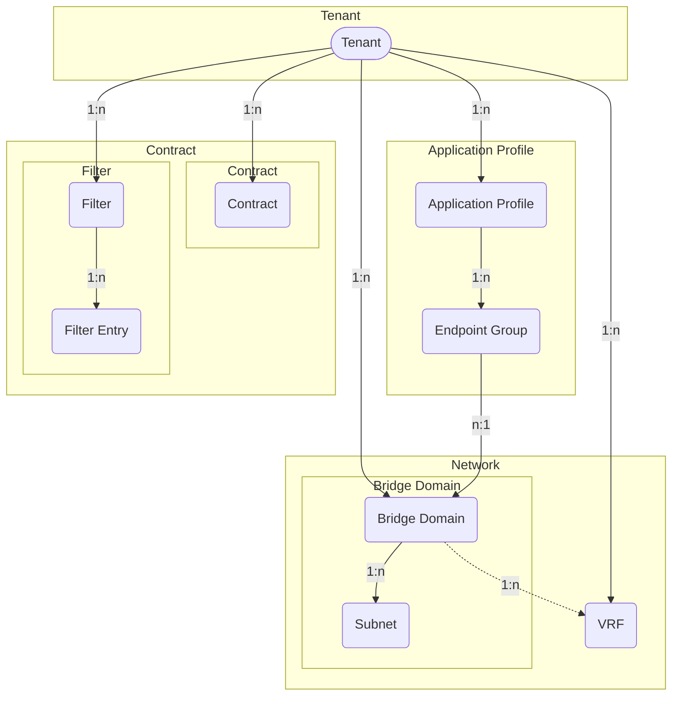

# Tenants

ACI fabric manages one or more *Tenants* based on the tenant portion of the
hierarchical management information tree (MIT).

## Tenant

A *Tenant* in the ACI policy model represents a container for application
policies with domain-based access control.
Tenants can be modeled after customers, organizations, domains, or used to
group policies.

The *ACITenant* model has the following fields:

*Required fields*:

- **Name**: represent the Tenant name in the ACI.

*Optional fields*:

- **Name alias**: a name alias in the ACI.
- **Description**: a description of the ACI Tenant.
- **NetBox Tenant**: an assignment to the NetBox tenant model.
- **Comments**: a text field for additional notes.
- **Tags**: a list of NetBox tags.

## Application Profile

An *Application Profile* contains *Endpoint Groups* (EPGs) and may be modeled
after applications, stages or domains.

The *ACIAppProfile* model has the following fields:

*Required fields*:

- **Name**: represent the Application Profile name in the ACI.
- **ACI Tenant**: a reference to the `ACITenant` model.

*Optional fields*:

- **Name alias**: a name alias in the ACI for the Application Profile.
- **Description**: a description of the Application Profile.
- **NetBox Tenant**: a reference to the NetBox tenant model.
- **Comments**: a text field for additional notes.
- **Tags**: a list of NetBox tags.

## VRF

A *VRF (virtual routing and forwarding)* instance defines a unique layer 3
forwarding, address and application policy domain for a *Tenant*.
The layer 3 domain must have unique IP addresses.
A *Tenant* can contain multiple VRFs.
Bridge Domains are associated with a VRF.

The *ACIVRF* model has the following fields:

*Required fields*:

- **Name**: represent the VRF name in the ACI.
- **ACI Tenant**: a reference to the `ACITenant` model.

*Optional fields*:

- **Name alias**: a name alias in the ACI for the VRF.
- **Description**: a description of the VRF.
- **NetBox Tenant**: a reference to the NetBox tenant model.
- **NetBox VRF**: a reference to the NetBox vrf model.
- **BD enforcement enabled**: a boolean field, whether endpoints can ping other
  bridge domain gateways.
  (default is *false*)
- **DNS labels**: a comma-separated list of DNS labels.
- **IP data plane learning enabled**: a boolean field representing whether IP
  data plane learning is enabled for the VRF.
  (default is *true*)
- **PC enforcement direction**: Direction of policy control enforcement.
  Values: `ingress` (ingress), `egress` (egress).
  (default is *ingress*)
- **PC enforcement preference**: Preference of policy control enforcement.
  Values: `enforced` (enforced), `unenforced` (unenforced).
  (default is *enforced*)
- **PIM IPv4 enabled**: a boolean field, whether IPv4 multicast is enabled.
  (default is *false*)
- **PIM IPv6 enabled**: a boolean field, whether IPv6 multicast is enabled.
  (default is *false*)
- **Preferred group enabled**: a boolean field, if the preferred group feature
  is enabled for the VRF.
  (default is *false*)
- **Comments**: a text field for additional notes.
- **Tags**: a list of NetBox tags.

## Bridge Domain

A *Bridge Domain* represents layer 2 forwarding and flood domain defining a
unique MAC address space.
Each Bridge Domain must be linked to a VRF instance.
One or more Subnets are associated with a Bridge Domain.

The *ACIBridgeDomain* model has the following fields:

*Required fields*:

- **Name**: represent the Bridge Domain name in the ACI.
- **ACI Tenant**: a reference to the `ACITenant` model.
- **ACI VRF**: a reference to the `ACIVRF` model.

*Optional fields*:

- **Name alias**: a name alias in the ACI for the Bridge Domain.
- **Description**: a description of the Bridge Domain.
- **NetBox Tenant**: a reference to the NetBox tenant model.
- **Advertise host routes enabled**: a boolean field, whether associated
  endpoints are advertised as host routes (/32 prefixes) out of the L3Outs.
  (default is *false*)
- **ARP flooding enabled**: a boolean field representing the state, whether
  Address Resolution Protocol (ARP) is flooded within the Bridge Domain.
  (default is *false*)
- **Clear remote mac entries enabled**: a boolean field, whether MAC endpoint
  entries should be deleted on remote leaves, when endpoints are removed from
  the local leaf.
  (default is *false*)
- **DHCP labels**: a comma-separated list of DHCP labels.
- **EP move detection enabled**: a boolean field documenting the state of
  endpoint move detection based on Gratuitous ARP (GARP).
  (default is *false*)
- **IGMP interface policy name**: the name of the IGMP interface policy.
- **IGMP snooping policy name**: the name of the IGMP snooping policy.
- **IP data plane learning enabled**: a boolean field representing whether IP
  data plane learning is enabled for the Bridge Domain.
  (default is *true*)
- **Limit IP learn enabled**: a boolean field, if IP learning is limited to the
  Bridge Domain's subnets.
  (default is *true*)
- **MAC address**: the MAC address of the Bridge Domain's gateway.
  (default is *00:22:BD:F8:19:FF*)
- **Multi destination flooding**: forwarding method for layer 2 multicast,
  broadcast and link layer traffic.
  Values: `bd-flood` (Bridge Domain flood),
  `encap-flood` (encapsulation flood), `drop` (drop).
  (default is *bd-flood*)
- **PIM IPv4 enabled**: a boolean field, whether IPv4 multicast is enabled.
  (default is *false*)
- **PIM IPv4 destination filter**: the name of the PIM IPv4 destination filter.
- **PIM IPv4 source filter**: the name of the PIM IPv4 source filter.
- **PIM IPv6 enabled**: a boolean field, whether IPv6 multicast is enabled.
  (default is *false*)
- **Unicast routing enabled**: a boolean field, whether unicast routing is.
  enabled (default is *true*)
- **Unknown IPv4 multicast**: defines the IPv4 unknown multicast forwarding
  method.
  Values: `flood` (flood), `opt-flood` (optimized flood).
  (default is *flood*)
- **Unknown IPv6 multicast**: defines the IPv6 unknown multicast forwarding
  method.
  Values: `flood` (flood), `opt-flood` (optimized flood).
  (default is *flood*)
- **Virtual MAC address**: the virtual MAC address of the Bridge Domain / SVI
  used when the Bridge Domain is extended to multiple sites using L2Outs.
- **Comments**: a text field for additional notes.
- **Tags**: a list of NetBox tags.

## Bridge Domain Subnet

A *Bridge Domain Subnet* is an anycast gateway IP address of the Bridge Domain.
The Subnet must be linked to a Bridge Domain instance.
One or more Subnets can be associated with a Bridge Domain, but only one Subnet
can be preferred.

The *ACIBridgeDomainSubnet* model has the following fields:

*Required fields*:

- **Name**: represent the Bridge Domain name in the ACI.
- **ACI Bridge Domain**: a reference to the `ACIBridgeDomain` model.
- **Gateway IP Address**: the gateway IP address of the Bridge Domain
  (referencing the NetBox IP address).

*Optional fields*:

- **Name alias**: a name alias in the ACI for the Bridge Domain Subnet.
- **Description**: a description of the Bridge Domain Subnet.
- **NetBox Tenant**: a reference to the NetBox tenant model.
- **Advertised externally enabled**: a boolean field, whether the subnet is
  advertised to the outside to any associated L3Outs (public scope).
  (default is *false*)
- **IGMP querier enabled**: a boolean field specifying whether the gateway
  IP address is treated as an IGMP querier source IP.
  (default is *false*)
- **IP data plane learning enabled**: a boolean field representing whether
  IP data plane learning is enabled for the Bridge Domain Subnet.
  (default is *true*)
- **No default SVI gateway**: a boolean field, if the default gateway
  functionality of the address is removed.
  (default is *false*)
- **ND RA enabled**: a boolean field, whether the gateway IP is treated as an
  IPv6 Neighbor Discovery Router Advertisement prefix.
  (default is *true*)
- **ND RA prefix policy name**: the name of the Neighbor Discovery Router
  Advertisement prefix policy.
- **Preferred IP address enabled**: a boolean field, if the gateway IP address
  is the preferred (primary) IP gateway of the Bridge Domain.
  (default is *false*)
- **Shared enabled**: a boolean field, if endpoints can communicate only within
  the same (*disabled*) or shared VRFs (*enabled*) in the ACI fabric
  (inter-VRF route leaking).
  (default is *false*)
- **Virtual IP enabled**: a boolean field determining if the gateway is a
  virtual IP address (used for stretched Bridge Domains to multiple sites).
  (default is *false*)
- **Comments**: a text field for additional notes.
- **Tags**: a list of NetBox tags.

## Endpoint Group

An *Endpoint Group* (EPG) is a named collection of endpoints (network-connected
devices).
The EPG needs to be contained in an Application Profile and be linked to a
Bridge Domain.

The *ACIEndpointGroup* model has the following fields:

*Required fields*:

- **Name**: represent the Endpoint Group name in the ACI.
- **ACI Application Profile**: containing the Endpoint Group.
- **ACI Bridge Domain**: linking the associated Bridge Domain.

*Optional fields*:

- **Name alias**: a name alias in the ACI for the Endpoint Group.
- **Description**: a description of the Endpoint Group.
- **NetBox Tenant**: a reference to the NetBox tenant model.
- **Admin shutdown**: a boolean field, whether the EPG is in shutdown mode,
  removing all policy configuration from all switches.
  (default is *false*)
- **Custom QoS policy name**: the name of the custom Quality of Service (Qos)
  policy name associated with the EPG.
- **Flood in encapsulation enabled**: a boolean field representing whether the
  flooding traffic is limited to the encapsulation of the EPG.
  (default is *false*)
- **Intra-EPG isolation enabled**: a boolean field, whether the communication
  between endpoints in the EPG is prevented.
  (default is *false*)
- **QoS class**: represents the assignment of the ACI Quality of Service (QoS)
  level for traffic sourced in the EPG.
  Values: `unspecified` (unspecified), `level1` (level 1), `level2` (level 2),
  `level3` (level 3), `level4` (level 4), `level5` (level 5),
  `level6` (level 6).
  (default is *unspecified*)
- **Preferred group member enabled**: a boolean field, if the EPG is a member
  of the preferred group and allows communication without contracts.
  (default is *false*)
- **Proxy-ARP enabled**: a boolean field, whether proxy ARP is enabled for the
  EPG.
  (default is *false*)
- **Comments**: a text field for additional notes.
- **Tags**: a list of NetBox tags.

## Contract Filter

A *Contract Filter* in the ACI policy model represents a filter that contains
multiple filter entries defining the type of traffic that is allowed or denied.
Each Contract Filter is associated with a *Tenant*.

The *ACIContractFilter* model has the following fields:

*Required fields*:

- **Name**: represent the Contract Filter name in the ACI.
- **ACI Tenant**: a reference to the `ACITenant` model.

*Optional fields*:

- **Name Alias**: an alias for the name of the filter in the ACI.
- **Description**: a brief description of the filter.
- **ACI Tenant**: a reference to the `ACITenant` model, associating the filter
  with a specific tenant.
- **NetBox Tenant**: a reference to the NetBox tenant model, linking the filter
  to a NetBox tenant.
- **Comments**: a text field for additional notes or comments.
- **Tags**: a list of NetBox tags.

## Contract Filter Entry

The *ACIContractFilterEntry* represents individual entries within a contract
filter, specifying the types of traffic that either pass through or are blocked
by the defined filter rules.
One or more filters can be linked to the `ACIContractFilter` model.

The *ACIContractFilterEntry* model has the following fields:

*Required fields*:

- **Name**: the name of the filter entry in the Contract Filter.
- **Contract Filter**: a reference to the `ACIContractFilter` model,
  associating the entry with a specific contract filter.

*Optional fields*:

- **Name Alias**: an alias for the name of the filter entry.
- **Description**: a brief description of the filter entry.
- **ARP OPC**: specifies the ARP open peripheral codes for *Ethernet Type*
  `arp` (ARP).
  Values: `unspecified` (unspecified), `req` (ARP request),
  `reply` (ARP reply).
  (default is *unspecified*)
- **Destination from-port**: sets the start of the filter destination port
  range, in case for *IP Protocol* `tcp` (TCP) or `udp` (UDP).
  Values: `unspecified` (unspecified), `dns` (DNS), `ftpData` (FTP Data),
  `http` (HTTP), `https` (HTTPS), `pop3` (POP3), `rtsp` (RTSP), `smtp` (SMTP),
  `ssh` (SSH) or in range of `0`–`65535`.
  (default is *unspecified*)
- **Destination to-port**: sets the end of the filter destination port range,
  in case for *IP Protocol* `tcp` (TCP) or `udp` (UDP).
  Values: `unspecified` (unspecified), `dns` (DNS), `ftpData` (FTP Data),
  `http` (HTTP), `https` (HTTPS), `pop3` (POP3), `rtsp` (RTSP), `smtp` (SMTP),
  `ssh` (SSH) or in range of `0`–`65535`.
  (default is *unspecified*)
- **Ethernet type**: declares the matching Ethernet type for the Filter Entry.
  Values: `unspecified` (unspecified), `arp` (ARP), `fcoe` (FCOE),
  `ip` (IP), `ipv4` (IPv4), `ipv6` (IPv6), `mac_security` (MAC Security),
  `mpls_ucast` (MPLS Unicast), `trill` (Trill).
  (default is *unspecified*)
- **ICMP v4 type**: matches the specified ICMPv4 message type for *IP Protocol*
  `icmp` (ICMPv4).
  Values: `unspecified` (unspecified), `dst-unreach` (destination unreachable),
  `echo` (echo request), `echo-rep` (echo reply), `src-quench` (source quench),
  `time-exceeded` (time exceeded).
  (default is *unspecified*)
- **ICMP v6 type**: matches the specified ICMPv6 message type for *IP Protocol*
  `icmpv6` (ICMPv6).
  Values: `unspecified` (unspecified), `dst-unreach` (destination unreachable),
  `echo-req` (echo request), `echo-rep` (echo reply),
  `nbr-advert` (neighbor advertisement), `nbr-solicit` (neighbor solicitation),
  `time-exceeded` (time exceeded).
  (default is *unspecified*)
- **IP protocol**: specifies the layer 3 IP protocol type for *Ethernet Type*
  `ip` (IP).
  Values: `unspecified` (unspecified), `egp` (EGP), `eigrp` (EIGRP),
  `icmp` (ICMPv4), `icmpv6` (ICMPv6), `igmp` (IGMP), `igp` (IGP),
  `l2tp` (L2TP), `ospfigp` (OSPF), `pim` (PIM), `tcp` (TCP), `udp` (UDP)
  or in range of `0`-`255`.
  (default is *unspecified*)
- **Match DSCP**: matches the specific DSCP (Differentiated Services Code
  Point) value for *Ethernet Type* `ip` (IP).
  Values: `unspecified` (unspecified), `AF11` (AF11), `AF12` (AF12),
  `AF13` (AF13), `AF21` (AF21), `AF22` (AF22), `AF23` (AF23), `AF31` (AF31),
  `AF32` (AF32), `AF33` (AF33), `AF41` (AF41), `AF42` (AF42), `AF43` (AF43),
  `CS0` (CS0), `CS1` (CS1), `CS2` (CS2), `CS3` (CS3) `CS4` (CS4), `CS5` (CS5),
  `CS6` (CS6), `CS7` (CS7), `EF` (Expedited Forwarding), `VA`, (Voice Admit).
  (default is *unspecified*)
- **Match only fragments enabled**: represents whether the filter rule
  matches only fragments with offset greater than 0 (all fragments except the
  first one).
  (default is *false*)
- **Source from-port**: sets the start of the filter source port range, in case
  for *IP Protocol* `tcp` (TCP) or `udp` (UDP).
  Values: `unspecified` (unspecified), `dns` (DNS), `ftpData` (FTP Data),
  `http` (HTTP), `https` (HTTPS), `pop3` (POP3), `rtsp` (RTSP), `smtp` (SMTP),
  `ssh` (SSH) or in range of `0`–`65535`.
  (default is *unspecified*)
- **Source to-port**: sets the end of the filter source port range, in case for
  *IP Protocol* `tcp` (TCP) or `udp` (UDP).
  Values: `unspecified` (unspecified), `dns` (DNS), `ftpData` (FTP Data),
  `http` (HTTP), `https` (HTTPS), `pop3` (POP3), `rtsp` (RTSP), `smtp` (SMTP),
  `ssh` (SSH) or in range of `0`–`65535`.
  (default is *unspecified*)
- **Stateful enabled**: allows TCP packets from provider to consumer only if
  the TCP flack ACK is set for *IP Protocol* `tcp` (TCP).
  (default is *false*)
- **TCP rules**: specifies a list of matching TCP flag values for *IP Protocol*
  `tcp` (TCP).
  Values: `unspecified` (unspecified), `ack` (acknowledgement),
  `est` (established), `fin` (finish), `rst` (reset), `syn` (synchronize).
  (default is *unspecified*)
- **Comments**: A text field for additional notes or comments.
- **Tags**: a list of NetBox tags.

## Contract

A *Contract* defines a set of policies that govern how traffic is permitted or
denied between endpoints.
Contracts consist of one or more associated *Contract Subjects* that define the
exact *Contract Filters* for allowed or denied traffic.

Each Contract is associated with an *ACI Tenant* and is used to manage the
communication between *Consumers* and *Providers*.

The *ACIContract* model has the following fields:

*Required fields*:

- **Name**: represent the Contract name in the ACI.
- **ACI Tenant**: a reference to the `ACITenant` model, associating the
  contract with a specific tenant.

*Optional fields*:

- **Name Alias**: an alias for the name of the contract in the ACI.
- **Description**: a brief description of the contract.
- **NetBox Tenant**: a reference to the NetBox tenant model, linking the
  contract to a NetBox tenant.
- **QoS class**: specifies the priority handling, Quality of Service (QoS), for
  traffic between Consumer and Provider within the fabric.
  Values: `unspecified` (unspecified), `level1` (level 1), `level2` (level 2),
  `level3` (level 3), `level4` (level 4), `level5` (level 5),
  `level6` (level 6).
  (default is *unspecified*)
- **Scope**: defines the extent within which the contract is applicable.
  Values: `context` (VRF), `application-profile` (Application Profile),
  `tenant` (Tenant), `global` (Global).
  (default is *context*)
- **Target DSCP**: rewrites the DSCP (Differentiated Services Code Point) value
  of the incoming traffic to the specified value.
  Values: `unspecified` (unspecified), `AF11` (AF11), `AF12` (AF12),
  `AF13` (AF13), `AF21` (AF21), `AF22` (AF22), `AF23` (AF23), `AF31` (AF31),
  `AF32` (AF32), `AF33` (AF33), `AF41` (AF41), `AF42` (AF42), `AF43` (AF43),
  `CS0` (CS0), `CS1` (CS1), `CS2` (CS2), `CS3` (CS3) `CS4` (CS4), `CS5` (CS5),
  `CS6` (CS6), `CS7` (CS7), `EF` (Expedited Forwarding), `VA`, (Voice Admit).
  (default is *unspecified*)
- **Comments**: a text field for additional notes or comments.
- **Tags**: a list of NetBox tags.
