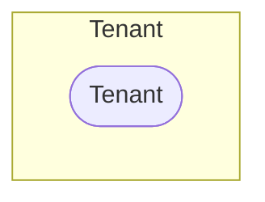

# Tenants

An ACI fabric manages one or more *tenants* based on the tenant portion of the hierarchical management information tree (MIT).

## Tenant

A *tenant* in the ACI policy model represents a container for application policies with domain-based access control. Tenants can be modeled after customers, organizations, domains, or used to group policies.

The *ACITenant* model has the following fields:

*Required fields*:

- **Name**: represent the tenant name in the ACI

*Optional fields*:

- **Alias**: an alias in the ACI
- **Description**: a description of the ACI tenant
- **NetBox Tenant**: an assignment to the NetBox tenant model
- **Comments**: a text field for additional notes
- **Tags**: a list of NetBox tags
