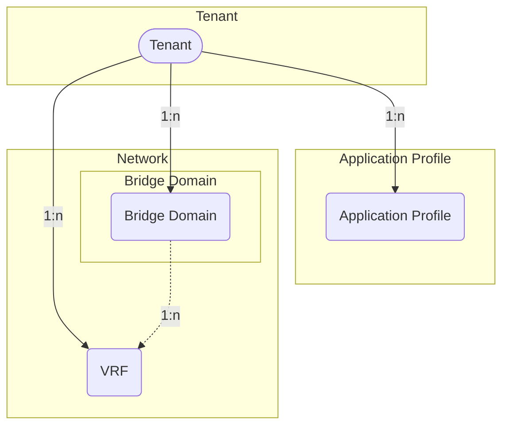

# Tenants

An ACI fabric manages one or more *tenants* based on the tenant portion of the hierarchical management information tree (MIT).

## Tenant

A *tenant* in the ACI policy model represents a container for application policies with domain-based access control. Tenants can be modeled after customers, organizations, domains, or used to group policies.

The *ACITenant* model has the following fields:

*Required fields*:

- **Name**: represent the tenant name in the ACI

*Optional fields*:

- **Name alias**: a name alias in the ACI
- **Description**: a description of the ACI tenant
- **NetBox Tenant**: an assignment to the NetBox tenant model
- **Comments**: a text field for additional notes
- **Tags**: a list of NetBox tags

## Application Profile

An *application profile* contains *endpoint groups* (EPGs) and may be modeled after applications, stages or domains.

The *ACIAppProfile* model has the following fields:

*Required fields*:

- **Name**: represent the application profile name in the ACI
- **ACI Tenant**: a reference to the ACITenant model.

*Optional fields*:

- **Name alias**: a name alias in the ACI for the application profile
- **Description**: a description of the application profile
- **NetBox Tenant**: a reference to the NetBox tenant model
- **Comments**: a text field for additional notes
- **Tags**: a list of NetBox tags

## VRF

A *VRF (virtual routing and forwarding)* instance defines an unique layer 3 forwarding, address and application policy domain for a *tenant*. The layer 3 domain must have unique IP addresses. A *tenant* can contain multiple VRFs. Bridge Domains are associated with a VRF.

The *ACIVRF* model has the following fields:

*Required fields*:

- **Name**: represent the VRF name in the ACI
- **ACI Tenant**: a reference to the ACITenant model.

*Optional fields*:

- **Name alias**: a name alias in the ACI for the VRF
- **Description**: a description of the VRF
- **NetBox Tenant**: a reference to the NetBox tenant model
- **NetBox VRF**: a reference to the NetBox vrf model
- **BD enforcement enabled**: a boolean field, whether endpoints can ping other bridge domain gateways (default is *false*)
- **DNS labels**: a comma-separated list of DNS labels
- **IP data plane learning enabled**: a boolean field representing whether IP data plane learning is enabled for the VRF. (default is *true*)
- **PC enforcement direction**: Direction of policy control enforcement, values: *ingress*, *egress* (default is *ingress*)
- **PC enforcement preference**: Preference of policy control enforcement, values: *enforced*, *unenforced* (default is *enforced*)
- **PIM IPv4 enabled**: a boolean field, whether IPv4 multicast is enabled (default is *false*)
- **PIM IPv6 enabled**: a boolean field, whether IPv6 multicast is enabled (default is *false*)
- **Preferred group enabled**: a boolean field, if preferred group feature is enabled for the VRF (default is *false*)
- **Comments**: a text field for additional notes
- **Tags**: a list of NetBox tags

## Bridge Domain

A *Bridge Domain* represents a layer 2 forwarding and flood domain defining an unique MAC address space.
Each Bridge Domain must be linked to a VRF instance. One or more Subnets are associated with a Bridge Domain.

The *ACIBridgeDomain* model has the following fields:

*Required fields*:

- **Name**: represent the Bridge Domain name in the ACI
- **ACI VRF**: a reference to the ACIVRF model.

*Optional fields*:

- **Name alias**: a name alias in the ACI for the Bridge Domain
- **Description**: a description of the Bridge Domain
- **NetBox Tenant**: a reference to the NetBox tenant model
- **Advertise host routes enabled**: a boolean field, whether associated endpoints are advertised as host routes (/32 prefixes) out of the L3Outs. (default is *false*)
- **ARP flooding enabled**: a boolean field representing the state, whether Address Resolution Protocol (ARP) are flooded within the Bridge Domain. (default is *false*)
- **Clear remote mac entries enabled**: a boolean field, whether MAC endpoint entries should be deleted on remote leaves, when endpoints are removed from the local leaf. (default is *false*)
- **DHCP labels**: a comma-separated list of DHCP labels
- **EP move detection enabled**: a boolean field documenting the state of endpoint move detection based on Gratuitous ARP (GARP). (default is *false*)
- **IGMP interface policy name**: the name of the IGMP interface policy
- **IGMP snooping policy name**: the name of the IGMP snooping policy
- **IP data plane learning enabled**: a boolean field representing whether IP data plane learning is enabled for the Bridge Domain. (default is *true*)
- **Limit IP learn enabled**: a boolean field, if IP learning is limited to the Bridge Domain's subnets. (default is *true*)
- **MAC address**: the MAC address of the Bridge Domain's gateway. (default is *00:22:BD:F8:19:FF*)
- **Multi destination flooding**: forwarding method for layer 2 multicast, broadcast, and link layer traffic, values: *bd-flood*, *encap-flood*, *drop* (default is *bd-flood*)
- **PIM IPv4 enabled**: a boolean field, whether IPv4 multicast is enabled (default is *false*)
- **PIM IPv4 destination filter**: the name of the PIM IPv4 destination filter
- **PIM IPv4 source filter**: the name of the PIM IPv4 source filter
- **PIM IPv6 enabled**: a boolean field, whether IPv6 multicast is enabled (default is *false*)
- **Unicast routing enabled**: a boolean field, whether unicast routing is enabled (default is *true*)
- **Unknown IPv4 multicast**: defines the IPv4 unknown multicast forwarding method, values: *flood*, *opt-flood* (default is *flood*)
- **Unknown IPv6 multicast**: defines the IPv6 unknown multicast forwarding method, values: *flood*, *opt-flood* (default is *flood*)
- **Virtual MAC address**: the virtual MAC address of the Bridge Domain / SVI used when the Bridge Domain is extended to multiple sites using L2Outs
- **Comments**: a text field for additional notes
- **Tags**: a list of NetBox tags
