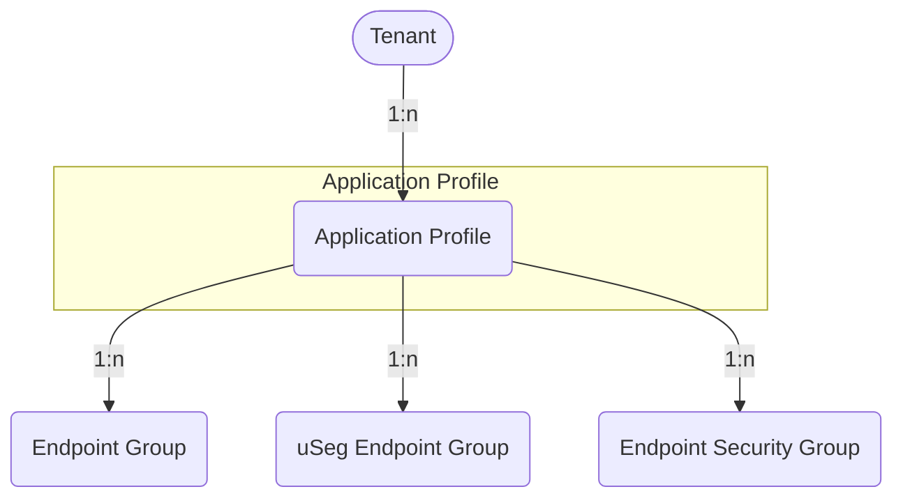

# Application Profile

Application Profiles group the endpoint policies of a Tenant, such as Endpoint Groups and Endpoint Security Groups.

## Application Profile

An *Application Profile* contains *Endpoint Groups* (EPGs) and may be modeled
after applications, stages or domains.

The *ACIAppProfile* model has the following fields:

*Required fields*:

- **Name**: represent the Application Profile name in the ACI.
- **ACI Tenant**: a reference to the `ACITenant` model.

*Optional fields*:

- **Name alias**: a name alias in the ACI for the Application Profile.
- **Description**: a description of the Application Profile.
- **NetBox Tenant**: a reference to the NetBox tenant model.
- **Comments**: a text field for additional notes.
- **Tags**: a list of NetBox tags.
