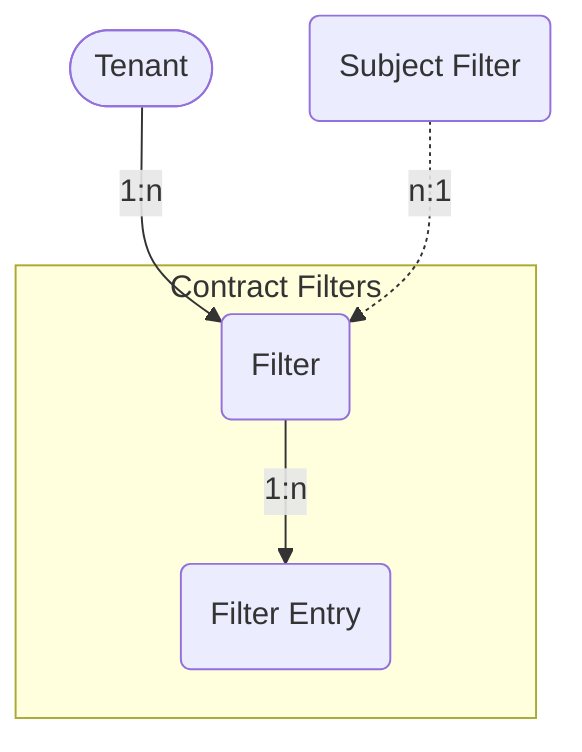

# Contract Filters

Contract Filters and their Filter Entries.

## Contract Filter

A *Contract Filter* in the ACI policy model represents a filter that contains
multiple filter entries defining the type of traffic that is allowed or denied.
Each Contract Filter is associated with a *Tenant*.

The *ACIContractFilter* model has the following fields:

*Required fields*:

- **Name**: represent the Contract Filter name in the ACI.
- **ACI Tenant**: a reference to the `ACITenant` model, associating the filter
  with a specific tenant.

*Optional fields*:

- **Name Alias**: an alias for the name of the filter in the ACI.
- **Description**: a brief description of the filter.
- **NetBox Tenant**: a reference to the NetBox tenant model, linking the filter
  to a NetBox tenant.
- **Comments**: a text field for additional notes or comments.
- **Tags**: a list of NetBox tags.

## Contract Filter Entry

The *ACIContractFilterEntry* represents individual entries within a contract
filter, specifying the types of traffic that either pass through or are blocked
by the defined filter rules.
One or more filters can be linked to the `ACIContractFilter` model.

The *ACIContractFilterEntry* model has the following fields:

*Required fields*:

- **Name**: the name of the filter entry in the Contract Filter.
- **Contract Filter**: a reference to the `ACIContractFilter` model,
  associating the entry with a specific contract filter.

*Optional fields*:

- **Name Alias**: an alias for the name of the filter entry.
- **Description**: a brief description of the filter entry.
- **ARP OPC**: specifies the ARP open peripheral codes for *Ethernet Type*
  `arp` (ARP).
    - Values: `unspecified` (unspecified), `req` (ARP request),
      `reply` (ARP reply)
    - Default: `unspecified`
- **Destination from-port**: sets the start of the filter destination port
  range, in case for *IP Protocol* `tcp` (TCP) or `udp` (UDP).
    - Values: `unspecified` (unspecified), `dns` (DNS), `ftpData` (FTP Data),
      `http` (HTTP), `https` (HTTPS), `pop3` (POP3), `rtsp` (RTSP),
      `smtp` (SMTP), `ssh` (SSH) or in range of `0`–`65535`
    - Default: `unspecified`
- **Destination to-port**: sets the end of the filter destination port range,
  in case for *IP Protocol* `tcp` (TCP) or `udp` (UDP).
    - Values: `unspecified` (unspecified), `dns` (DNS), `ftpData` (FTP Data),
      `http` (HTTP), `https` (HTTPS), `pop3` (POP3), `rtsp` (RTSP),
      `smtp` (SMTP), `ssh` (SSH) or in range of `0`–`65535`
    - Default: `unspecified`
- **Ethernet type**: declares the matching Ethernet type for the Filter Entry.
    - Values: `unspecified` (unspecified), `arp` (ARP), `fcoe` (FCOE),
      `ip` (IP), `ipv4` (IPv4), `ipv6` (IPv6), `mac_security` (MAC Security),
      `mpls_ucast` (MPLS Unicast), `trill` (Trill)
    - Default: `unspecified`
- **ICMP v4 type**: matches the specified ICMPv4 message type for *IP Protocol*
  `icmp` (ICMPv4).
    - Values: `unspecified` (unspecified),
      `dst-unreach` (destination unreachable), `echo` (echo request),
      `echo-rep` (echo reply), `src-quench` (source quench),
      `time-exceeded` (time exceeded)
    - Default: `unspecified`
- **ICMP v6 type**: matches the specified ICMPv6 message type for *IP Protocol*
  `icmpv6` (ICMPv6).
    - Values: `unspecified` (unspecified),
      `dst-unreach` (destination unreachable), `echo-req` (echo request),
      `echo-rep` (echo reply), `nbr-advert` (neighbor advertisement),
      `nbr-solicit` (neighbor solicitation), `time-exceeded` (time exceeded)
    - Default: `unspecified`
- **IP protocol**: specifies the layer 3 IP protocol type for *Ethernet Type*
  `ip` (IP).
    - Values: `unspecified` (unspecified), `egp` (EGP), `eigrp` (EIGRP),
      `icmp` (ICMPv4), `icmpv6` (ICMPv6), `igmp` (IGMP), `igp` (IGP),
      `l2tp` (L2TP), `ospfigp` (OSPF), `pim` (PIM), `tcp` (TCP), `udp` (UDP)
      or in range of `0`-`255`
    - Default: `unspecified`
- **Match DSCP**: matches the specific DSCP (Differentiated Services Code
  Point) value for *Ethernet Type* `ip` (IP).
    - Values: `unspecified`, `AF11`, `AF12`, `AF13`, `AF21`, `AF22`, `AF23`,
      `AF31`, `AF32`, `AF33`, `AF41`, `AF42`, `AF43`, `CS0`, `CS1`, `CS2`,
      `CS3`, `CS4`, `CS5`, `CS6`, `CS7`, `EF`, `VA`
    - Default: `unspecified`
- **Match only fragments enabled**: represents whether the filter rule
  matches only fragments with offset greater than 0 (all fragments except the
  first one).
    - Default: `false`
- **Source from-port**: sets the start of the filter source port range, in case
  for *IP Protocol* `tcp` (TCP) or `udp` (UDP).
    - Values: `unspecified` (unspecified), `dns` (DNS), `ftpData` (FTP Data),
      `http` (HTTP), `https` (HTTPS), `pop3` (POP3), `rtsp` (RTSP),
      `smtp` (SMTP), `ssh` (SSH) or in range of `0`–`65535`
    - Default: `unspecified`
- **Source to-port**: sets the end of the filter source port range, in case for
  *IP Protocol* `tcp` (TCP) or `udp` (UDP).
    - Values: `unspecified` (unspecified), `dns` (DNS), `ftpData` (FTP Data),
      `http` (HTTP), `https` (HTTPS), `pop3` (POP3), `rtsp` (RTSP),
      `smtp` (SMTP), `ssh` (SSH) or in range of `0`–`65535`
    - Default: `unspecified`
- **Stateful enabled**: allows TCP packets from provider to consumer only if
  the TCP flack ACK is set for *IP Protocol* `tcp` (TCP).
    - Default: `false`
- **TCP rules**: specifies a list of matching TCP flag values for *IP Protocol*
  `tcp` (TCP).
    - Values: `unspecified` (unspecified), `ack` (acknowledgement),
      `est` (established), `fin` (finish), `rst` (reset), `syn` (synchronize)
    - Default: `unspecified`
- **Comments**: A text field for additional notes or comments.
- **Tags**: a list of NetBox tags.
