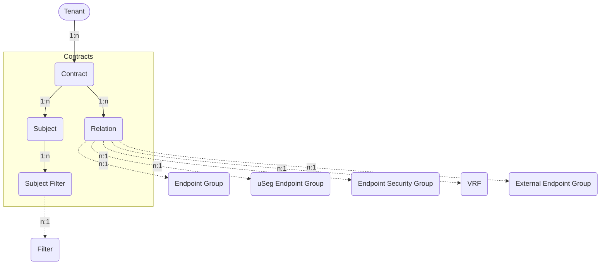

# Contracts

Contracts and their Relations, Subjects, and Subject Filters.

## Contract

A *Contract* defines a set of policies that govern how traffic is permitted or
denied between endpoints.
Contracts consist of one or more associated *Contract Subjects* that define the
exact *Contract Filters* for allowed or denied traffic.

Each Contract is associated with an *ACI Tenant* and is used to manage the
communication between *Consumers* and *Providers*.

The *ACIContract* model has the following fields:

*Required fields*:

- **Name**: represent the Contract name in the ACI.
- **ACI Tenant**: a reference to the `ACITenant` model, associating the
  contract with a specific tenant.

*Optional fields*:

- **Name Alias**: an alias for the name of the contract in the ACI.
- **Description**: a brief description of the contract.
- **NetBox Tenant**: a reference to the NetBox tenant model, linking the
  contract to a NetBox tenant.
- **QoS class**: specifies the priority handling, Quality of Service (QoS), for
  traffic between Consumer and Provider within the fabric.
    - Values: `unspecified` (unspecified), `level1` (level 1),
      `level2` (level 2), `level3` (level 3), `level4` (level 4),
      `level5` (level 5), `level6` (level 6)
    - Default: `unspecified`
- **Scope**: defines the extent within which the contract is applicable.
    - Values: `context` (VRF), `application-profile` (Application Profile),
      `tenant` (Tenant), `global` (Global).
    - Default: `context`
- **Target DSCP**: rewrites the DSCP (Differentiated Services Code Point) value
  of the incoming traffic to the specified value.
    - Values: `unspecified`, `AF11`, `AF12`, `AF13`, `AF21`, `AF22`, `AF23`,
      `AF31`, `AF32`, `AF33`, `AF41`, `AF42`, `AF43`, `CS0`, `CS1`, `CS2`,
      `CS3`, `CS4`, `CS5`, `CS6`, `CS7`, `EF`, `VA`
    - Default: `unspecified`
- **Comments**: a text field for additional notes or comments.
- **Tags**: a list of NetBox tags.

## Contract Relation

A *Contract Relation* links an *ACI Contract* to supported ACI objects,
such as *Endpoint Groups* (EPG), *uSeg Endpoint Groups* (uSeg EPG),
*Endpoint Security Groups* (ESG) and *Virtual Routing and Forwarding*
(VRF) instances.

A *Contract Relation* defines whether the associated *ACI Contract* acts
as a **Provider** or **Consumer** for the linked ACI object.

The assigned *ACI Contract* and the associated ACI object must belong to
the same *ACI Fabric*.
In addition, the *ACI Contract* must either belong to the same
*ACI Tenant* as the ACI object, or to the `common` *ACI Tenant* within
that same *ACI Fabric*.

The *ACIContractRelation* model has the following fields:

*Required fields*:

- **ACI Contract**: a reference to the related `ACIContract` model.
  This defines the ACI Contract associated with the relation.
- **ACI Object Type**: the type of the target ACI object in the form
  `app.model`.
    - Values: `netbox_aci_plugin.aciendpointgroup` (Endpoint Group),
      `netbox_aci_plugin.aciendpointsecuritygroup` (Endpoint Security Group),
      `netbox_aci_plugin.aciexternalendpointgroup` (External Endpoint Group),
      `netbox_aci_plugin.aciusegendpointgroup` (uSeg Endpoint Group),
      `netbox_aci_plugin.acivrf` (VRF)
- **ACI Object ID**: the primary key of the specific ACI object.

*Optional fields*:

- **Role**: specifies the role of the ACI Contract for the associated
  ACI object.
    - Values: `prov` (Provider), `cons` (Consumer)
    - Default: `prov`
- **Comments**: a text field for additional notes or comments.
- **Tags**: a list of NetBox tags.

## Contract Subject

A *Contract Subject* defines how contract filters and service graph templates
are applied within a *Contract*.
Each Subject is associated with an *ACI Contract*.

The *ACIContractSubject* model has the following fields:

*Required fields*:

- **Name**: represent the Contract Subject name in the ACI.
- **ACI Contract**: a reference to the `ACIContract` model, associating the
  subject with a specific contract.

*Optional fields*:

- **Name Alias**: an alias for the name of the subject in the ACI.
- **Description**: a brief description of the subject.
- **NetBox Tenant**: a reference to the NetBox tenant model, linking the
  subject to a NetBox tenant.
- **Apply both directions enabled**: indicates whether the filter associated
  with the subject is applied in both directions
  (consumer-to-provider and provider-to-consumer).
    - Default: `true`
- **QoS class**: specifies the priority handling, Quality of Service (QoS), for
  traffic between Consumer and Provider within the fabric.
    - Values: `unspecified` (unspecified), `level1` (level 1),
      `level2` (level 2), `level3` (level 3), `level4` (level 4),
      `level5` (level 5), `level6` (level 6)
    - Default: `unspecified`
- **QoS class Consumer to Provider**: specifies the priority handling,
  Quality of Service (QoS), for traffic from Consumer to Provider within the
  fabric (for disabled `apply_both_directions_enabled`).
    - Values: `unspecified` (unspecified), `level1` (level 1),
      `level2` (level 2), `level3` (level 3), `level4` (level 4),
      `level5` (level 5), `level6` (level 6)
      - Default: `unspecified`
- **QoS class Provider to Consumer**: specifies the priority handling,
  Quality of Service (QoS), for traffic from Provider to Consumer within the
  fabric (for disabled `apply_both_directions_enabled`).
    - Values: `unspecified` (unspecified), `level1` (level 1),
      `level2` (level 2), `level3` (level 3), `level4` (level 4),
      `level5` (level 5), `level6` (level 6)
    - Default: `unspecified`
- **Reverse filter ports enabled**: Indicates whether the source and
  destination ports of the associated filter within the subject are reversed
  for the return traffic.
    - Default: `true`
- **Service Graph name**: the name of the Service Graph Template
  associated with the subject.
- **Service Graph name Consumer to Provider**: the name of the Service Graph
  Template associated with the subject for traffic from Consumer to
  Provider (for disabled `apply_both_directions_enabled`).
- **Service Graph name Provider to Consumer**: the name of the Service Graph
  Template associated with the subject for traffic from Provider to
  Consumer (for disabled `apply_both_directions_enabled`).
- **Target DSCP**: rewrites the DSCP (Differentiated Services Code Point) value
  of the incoming traffic to the specified value.
    - Values: `unspecified`, `AF11`, `AF12`, `AF13`, `AF21`, `AF22`, `AF23`,
      `AF31`, `AF32`, `AF33`, `AF41`, `AF42`, `AF43`, `CS0`, `CS1`, `CS2`,
      `CS3`, `CS4`, `CS5`, `CS6`, `CS7`, `EF`, `VA`
    - Default: `unspecified`
- **Target DSCP Consumer to Provider**: rewrites the DSCP (Differentiated
  Services Code Point) value of the incoming traffic to the specified value
  for traffic from Consumer to Provider within the fabric
  (for disabled `apply_both_directions_enabled`).
    - Values: `unspecified`, `AF11`, `AF12`, `AF13`, `AF21`, `AF22`, `AF23`,
      `AF31`, `AF32`, `AF33`, `AF41`, `AF42`, `AF43`, `CS0`, `CS1`, `CS2`,
      `CS3`, `CS4`, `CS5`, `CS6`, `CS7`, `EF`, `VA`
    - Default: `unspecified`
- **Target DSCP Provider to Consumer**: rewrites the DSCP (Differentiated
  Services Code Point) value of the incoming traffic to the specified value
  for traffic from Provider to Consumer within the fabric
  (for disabled `apply_both_directions_enabled`).
    - Values: `unspecified`, `AF11`, `AF12`, `AF13`, `AF21`, `AF22`, `AF23`,
      `AF31`, `AF32`, `AF33`, `AF41`, `AF42`, `AF43`, `CS0`, `CS1`, `CS2`,
      `CS3`, `CS4`, `CS5`, `CS6`, `CS7`, `EF`, `VA`
    - Default: `unspecified`
- **Comments**: a text field for additional notes or comments.
- **Tags**: a list of NetBox tags.

## Contract Subject Filter

The *Contract Subject Filter* defines the association of a *Contract Filter*
with a *Contract Subject*.
It specifies how the filter is applied to traffic between consumer and
provider endpoints.

The *ACIContractSubjectFilter* model has the following fields:

*Required fields*:

- **ACI Contract Filter**: links to the associated `ACIContractFilter` model.
- **ACI Contract Subject**: ties the filter to the `ACIContractSubject` model,
  associating the given filter with a specific ACI Contract Subject.

*Optional fields*:

- **Action**: determines whether the traffic is permitted or denied.
    - Values: `permit`, `deny`
    - Default: `permit`
- **Apply direction**: specifies the direction to apply the filter.
    - Values: `both` (both directions), `ctp` (consumer to provider),
      `ptc` (provider to consumer)
    - Default: `both`
- **Log enabled**: indicates whether logging is enabled for the applied filter.
    - Default: `false`
- **Policy Compression enabled**: specifies whether policy-based compression
  for filtering is enabled.
  This reduces the number of rules in the TCAM.
    - Default: `false`
- **Priority**: sets the priority of deny actions.
  The value is only valid for *action* `deny`.
    - Values: `default` (default level), `level1` (level 1),
      `level2` (level 2), `level3` (level 3)
    - Default: `default`
- **Comments**: a text field for additional notes or comments.
- **Tags**: a list of NetBox tags.
