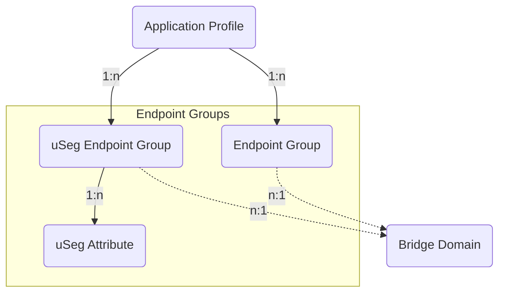

# Endpoint Groups

Endpoint Groups (EPG) and micro-segmented (uSeg) Endpoint Groups with their network attributes.

## Endpoint Group

An *Endpoint Group* (EPG) is a named collection of endpoints (network-connected
devices).
The EPG needs to be contained in an Application Profile and be linked to a
Bridge Domain.

The *ACIEndpointGroup* model has the following fields:

*Required fields*:

- **Name**: represent the Endpoint Group name in the ACI.
- **ACI Application Profile**: containing the Endpoint Group.
- **ACI Bridge Domain**: linking the associated Bridge Domain.

*Optional fields*:

- **Name alias**: a name alias in the ACI for the Endpoint Group.
- **Description**: a description of the Endpoint Group.
- **NetBox Tenant**: a reference to the NetBox tenant model.
- **Admin shutdown**: a boolean field, whether the EPG is in shutdown mode,
  removing all policy configuration from all switches.
    - Default: `false`
- **Custom QoS policy name**: the name of the custom Quality of Service (Qos)
  policy name associated with the EPG.
- **Flood in encapsulation enabled**: a boolean field representing whether the
  flooding traffic is limited to the encapsulation of the EPG.
    - Default: `false`
- **Intra-EPG isolation enabled**: a boolean field, whether the communication
  between endpoints in the EPG is prevented.
    - Default: `false`
- **QoS class**: represents the assignment of the ACI Quality of Service (QoS)
  level for traffic sourced in the EPG.
    - Values: `unspecified` (unspecified), `level1` (level 1),
      `level2` (level 2), `level3` (level 3), `level4` (level 4),
      `level5` (level 5), `level6` (level 6)
    - Default: `unspecified`
- **Preferred group member enabled**: a boolean field, if the EPG is a member
  of the preferred group and allows communication without contracts.
    - Default: `false`
- **Proxy-ARP enabled**: a boolean field, whether proxy ARP is enabled for the
  EPG.
    - Default: `false`
- **Comments**: a text field for additional notes.
- **Tags**: a list of NetBox tags.

## uSeg Endpoint Group

An *uSeg Endpoint Group* (uSeg EPG) is a named collection of endpoints
(network-connected devices) based on attributes for micro segmentation (uSeg).
The EPG needs to be contained in an Application Profile and be linked to a
Bridge Domain.
uSeg Endpoint Groups consist of one or more associated
*uSeg Network Attributes* defining the attributes segmenting one or more
endpoints.

The *ACIUSegEndpointGroup* model has the following fields:

*Required fields*:

- **Name**: represents the uSeg Endpoint Group name in the ACI.
- **ACI Application Profile**: indicates the Application Profile that contains
  this uSeg Endpoint Group.
- **ACI Bridge Domain**: links the associated Bridge Domain.

*Optional fields*:

- **Name alias**: a name alias in the ACI for the uSeg Endpoint Group.
- **Description**: a description of the uSeg Endpoint Group.
- **NetBox Tenant**: a reference to the NetBox tenant model.
- **Admin shutdown**: a boolean field, whether the uSeg EPG is in shutdown
  mode, removing all policy configuration from all switches.
    - Default: `false`
- **Custom QoS policy name**: the name of the custom Quality of Service (Qos)
  policy name associated with the uSeg EPG.
- **Flood in encapsulation enabled**: a boolean field representing whether the
  flooding traffic is limited to the encapsulation of the uSeg EPG.
    - Default: `false`
- **Intra-EPG isolation enabled**: a boolean field, whether the communication
  between endpoints in the uSeg EPG is prevented.
    - Default: `false`
- **Match operator**: specifies the match operation for the referenced uSeg
  attributes.
    - Values: `any` (any), `all` (all),
    - Default: `any`
- **QoS class**: represents the assignment of the ACI Quality of Service (QoS)
  level for traffic sourced in the uSeg EPG.
    - Values: `unspecified` (unspecified), `level1` (level 1),
      `level2` (level 2), `level3` (level 3), `level4` (level 4),
      `level5` (level 5), `level6` (level 6)
    - Default: `unspecified`
- **Preferred group member enabled**: a boolean field, if the uSeg EPG is a
  member of the preferred group and allows communication without contracts.
    - Default: `false`
- **Comments**: a text field for additional notes.
- **Tags**: a list of NetBox tags.

## uSeg Network Attribute

The *ACIUSegNetworkAttribute* model represents a network attribute associated
with a uSeg Endpoint Group.
This attribute is used to segment endpoints based on network parameters — such
as IP address, MAC address or network prefix information.

The *ACIUSegNetworkAttribute* model has the following fields:

*Required fields*:

- **Name**: represents the uSeg Network Attribute name in the ACI.
- **ACI uSeg Endpoint Group**: a reference to the uSeg Endpoint Group
  associated with this network attribute.

*Optional fields*:

- **Name alias**: an alternate name for the uSeg Network Attribute.
- **Description**: a description of the uSeg Network Attribute.
- **NetBox Tenant**: a reference to the NetBox tenant model.
- **Attribute Object Type**: defines the type of the associated network object
  (e.g., *IPAddress*, *MACAddress*, *Prefix*) in the form `app.model`.
- **Attribute Object ID**: represents the (database) identifier for the
  associated object.
- **Attribute Object**: references the specific network object to which this
  attribute applies.
- **Use EPG Subnet**: a boolean indicating whether the uSeg Endpoint Group's
  subnet should be used.
    - Default: `false`
- **Type**: specifies the ACI uSeg category of the network attribute
  (read-only).
- **Comments**: a text field for additional notes.
- **Tags**: a list of NetBox tags.
