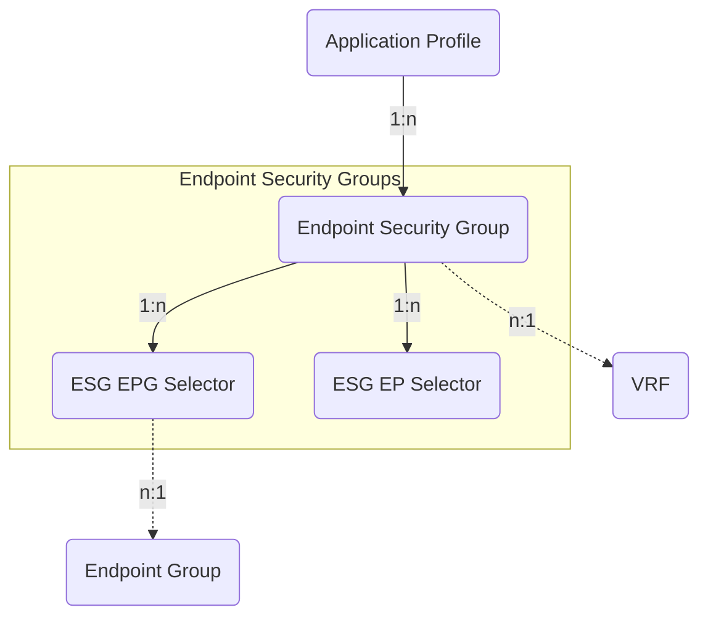

# Endpoint Security Groups

Endpoint Security Groups (ESG) and their EPG and endpoint selectors.

## Endpoint Security Group

An *Endpoint Security Group* (ESG) is a named set of endpoints
(network-connected devices) that applies security policies based on specified
attributes.
The ESG must be contained in an Application Profile and be linked to a VRF.

The *ACIEndpointSecurityGroup* model has the following fields:

*Required fields*:

- **Name**: represents the Endpoint Security Group name in the ACI.
- **ACI Application Profile**: containing the Endpoint Security Group.
- **ACI VRF**: a reference to the associated VRF.

*Optional fields*:

- **Name alias**: a name alias in the ACI for the Endpoint Security Group.
- **Description**: a description of the Endpoint Group.
- **NetBox Tenant**: a reference to the NetBox tenant model.
- **Admin shutdown**: a boolean field indicating whether the ESG is in shutdown
  mode, removing all policy configuration from all switches.
    - Default: `false`
- **Intra-ESG isolation enabled**: a boolean field indicating whether the
  communication between endpoints in the ESG is prevented.
    - Default: `false`
- **Preferred group member enabled**: a boolean field indicating whether the
  ESG is in the preferred group, allowing communication without contracts.
    - Default: `false`
- **Comments**: a text field for additional notes.
- **Tags**: a list of NetBox tags.

## ESG Endpoint Group (EPG) Selector

The *ACIEsgEndpointGroupSelector* model represents an Endpoint Group selector
associated with an Endpoint Security Group.
This selector is used to match Endpoint Groups based on the specified
Endpoint Groups.

The *ACIEsgEndpointGroupSelector* model has the following fields:

*Required fields*:

- **Name**: represents the ESG Endpoint Group Selector name in the ACI.
- **ACI Endpoint Security Group**: a reference to the Endpoint Security Group
  associated with this endpoint group selector.

*Optional fields*:

- **Name alias**: an alternate name for the ESG Endpoint Group Selector.
- **Description**: a description of the ESG Endpoint Group Selector.
- **NetBox Tenant**: a reference to the NetBox tenant model.
- **ACI EPG Object Type**: defines the type of the associated Endpoint Group
  object (e.g., *ACIEndpointGroup*, *ACIUSegEndpointGroup*) in the form
  `app.model`.
- **ACI EPG Object ID**: represents the (database) identifier for the
  associated object.
- **ACI EPG Object**: references the specific ACI Endpoint Group object to
  which this selector applies.
- **Comments**: a text field for additional notes.
- **Tags**: a list of NetBox tags.

## ESG Endpoint Selector

The *ACIEsgEndpointSelector* model represents an endpoint selector associated
with an Endpoint Security Group.
This selector is used to match specified endpoints based on network
parameters — such as IP addresses or network prefix information.

The *ACIEsgEndpointSelector* model has the following fields:

*Required fields*:

- **Name**: represents the ESG Endpoint Selector name in the ACI.
- **ACI Endpoint Security Group**: a reference to the Endpoint Security Group
  associated with this endpoint selector.

*Optional fields*:

- **Name alias**: an alternate name for the ESG Endpoint Selector.
- **Description**: a description of the ESG Endpoint Selector.
- **NetBox Tenant**: a reference to the NetBox tenant model.
- **Endpoint Object Type**: defines the type of the associated endpoint object
  (e.g., *IPAddress*, *Prefix*) in the form `app.model`.
- **Endpoint Object ID**: represents the (database) identifier for the
  associated object.
- **Endpoint Object**: references the specific network object to which this
  selector applies.
- **Comments**: a text field for additional notes.
- **Tags**: a list of NetBox tags.
