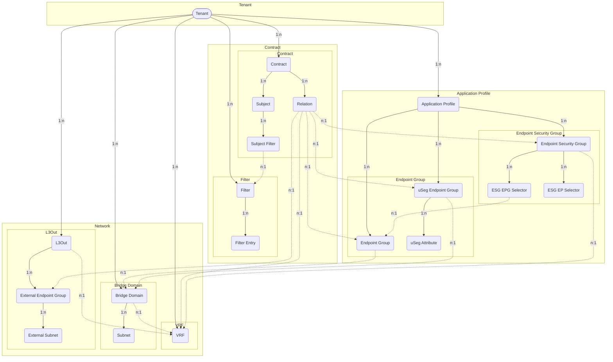

# Tenants

ACI fabric manages one or more *Tenants* based on the tenant portion of the
hierarchical management information tree (MIT).

## Tenant

A *Tenant* in the ACI policy model represents a container for application
policies with domain-based access control.
Tenants can be modeled after customers, organizations, domains, or used to
group policies.

The *ACITenant* model has the following fields:

*Required fields*:

- **Name**: represent the Tenant name in the ACI.
- **ACI Fabric**: a reference to the `ACIFabric` model.

*Optional fields*:

- **Name alias**: a name alias in the ACI.
- **Description**: a description of the ACI Tenant.
- **NetBox Tenant**: an assignment to the NetBox tenant model.
- **Comments**: a text field for additional notes.
- **Tags**: a list of NetBox tags.
