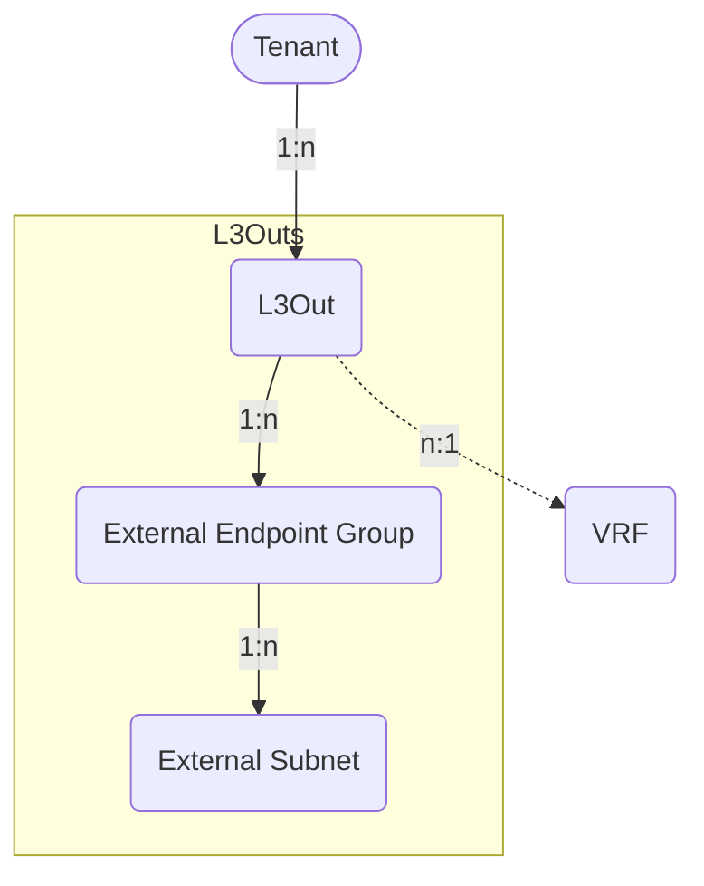

# L3Outs

Layer 3 Outside connections, External Endpoint Groups, and External Subnets.

## L3Out

An *L3Out* represents routed external connectivity for an ACI Tenant. It is
associated with a VRF and an ACI Routed Domain. External Endpoint Groups and
External Subnets define how external networks are classified and how contracts
are applied to traffic entering or leaving the fabric.

The *ACIL3Out* model has the following fields:

*Required fields*:

- **Name**: represents the L3Out name in the ACI.
- **ACI Tenant**: a reference to the `ACITenant` model.
- **ACI VRF**: a reference to the `ACIVRF` model.
- **ACI Routed Domain**: a reference to the `ACIRoutedDomain` model.

*Optional fields*:

- **Name alias**: a name alias in the ACI for the L3Out.
- **Description**: a description of the L3Out.
- **NetBox Tenant**: a reference to the NetBox tenant model.
- **BFD policy name**: the name of the BFD policy associated with the L3Out.
- **BGP enabled**: a boolean field, whether BGP is enabled for the L3Out.
  - Default: `false`
- **Custom QoS policy name**: the name of the custom QoS policy associated with
  the L3Out.
- **Egress data plane policing policy name**: the name of the egress data plane
  policing policy associated with the L3Out.
- **EIGRP enabled**: a boolean field, whether EIGRP is enabled for the L3Out.
  - Default: `false`
- **EIGRP interface policy name**: the name of the EIGRP interface policy
  associated with the L3Out.
- **Export route control enforcement enabled**: a read-only boolean field; export
  route control enforcement is always enabled for APIC L3Outs and cannot be
  disabled.
  - Default: `true`
- **IGMP interface policy name**: the name of the IGMP interface policy
  associated with the L3Out.
- **Import route control enforcement enabled**: a boolean field, whether import
  route control enforcement is enabled for the L3Out.
  - Default: `false`
- **Ingress data plane policing policy name**: the name of the ingress data
  plane policing policy associated with the L3Out.
- **Interleak route map name**: the name of the route map used for inter-VRF
  route leaking.
- **L3 multicast IPv4 enabled**: a boolean field, whether IPv4 Layer 3 multicast
  is enabled for the L3Out.
  - Default: `false`
- **L3 multicast IPv6 enabled**: a boolean field, whether IPv6 Layer 3 multicast
  is enabled for the L3Out.
  - Default: `false`
- **Multi-Pod enabled**: a boolean field documenting that the L3Out is used for
  ACI Multi-Pod. This option is only valid for L3Outs in the `infra` ACI Tenant.
  - Default: `false`
- **OSPF enabled**: a boolean field, whether OSPF is enabled for the L3Out.
  - Default: `false`
- **OSPF external policy name**: the name of the OSPF external policy associated
  with the L3Out.
- **PIM policy name**: the name of the PIM policy associated with the L3Out.
- **Target DSCP**: rewrites the DSCP (Differentiated Services Code Point) value
  of the incoming traffic to the specified value.
  - Values: `unspecified`, `AF11`, `AF12`, `AF13`, `AF21`, `AF22`, `AF23`,
    `AF31`, `AF32`, `AF33`, `AF41`, `AF42`, `AF43`, `CS0`, `CS1`, `CS2`,
    `CS3`, `CS4`, `CS5`, `CS6`, `CS7`, `EF`, `VA`
  - Default: `unspecified`
- **Comments**: a text field for additional notes.
- **Tags**: a list of NetBox tags.

## External Endpoint Group

An *External Endpoint Group* represents a group of external networks associated
with an L3Out. Contract Relations can be associated with External Endpoint
Groups to define provider or consumer behavior for routed external networks.

The *ACIExternalEndpointGroup* model has the following fields:

*Required fields*:

- **Name**: represents the External Endpoint Group name in the ACI.
- **ACI L3Out**: a reference to the `ACIL3Out` model.

*Optional fields*:

- **Name alias**: a name alias in the ACI for the External Endpoint Group.
- **Description**: a description of the External Endpoint Group.
- **NetBox Tenant**: a reference to the NetBox tenant model.
- **Preferred group member enabled**: a boolean field, if the External Endpoint
  Group is a member of the preferred group and allows communication without
  contracts.
  - Default: `false`
- **QoS class**: represents the assignment of the ACI Quality of Service (QoS)
  level for traffic sourced by the External Endpoint Group.
  - Values: `unspecified` (unspecified), `level1` (level 1), `level2` (level 2),
    `level3` (level 3), `level4` (level 4), `level5` (level 5),
    `level6` (level 6)
  - Default: `unspecified`
- **Target DSCP**: rewrites the DSCP (Differentiated Services Code Point) value
  of the incoming traffic to the specified value.
  - Values: `unspecified`, `AF11`, `AF12`, `AF13`, `AF21`, `AF22`, `AF23`,
    `AF31`, `AF32`, `AF33`, `AF41`, `AF42`, `AF43`, `CS0`, `CS1`, `CS2`,
    `CS3`, `CS4`, `CS5`, `CS6`, `CS7`, `EF`, `VA`
  - Default: `unspecified`
- **Comments**: a text field for additional notes.
- **Tags**: a list of NetBox tags.

## External Subnet

An *External Subnet* represents a prefix associated with an External Endpoint
Group. External Subnets define the route-control and security classification of
external prefixes.

The *ACIExternalSubnet* model has the following fields:

*Required fields*:

- **Name**: represents the External Subnet name in the ACI.
- **ACI External Endpoint Group**: a reference to the
  `ACIExternalEndpointGroup` model.
- **Matched Prefix**: an IPv4 or IPv6 prefix matched by this External Subnet.
  Required when no NetBox Prefix is selected.

*Optional fields*:

- **Name alias**: a name alias in the ACI for the External Subnet.
- **Description**: a description of the External Subnet.
- **NetBox Prefix**: an optional reference to the NetBox Prefix model. When
  selected, the NetBox Prefix is used as the matched prefix for the External
  Subnet.
- **Import route control enabled**: a boolean field, whether the External Subnet
  is classified for import route control.
  - Default: `false`
- **Export route control enabled**: a boolean field, whether the External Subnet
  is classified for export route control.
  - Default: `false`
- **Shared route control enabled**: a boolean field, whether the External Subnet
  is classified for shared route control.
  - Default: `false`
- **Import security enabled**: a boolean field, whether the External Subnet is
  classified for security import.
  - Default: `true`
- **Shared security enabled**: a boolean field, whether the External Subnet is
  classified for shared security import.
  - Default: `false`
- **Aggregate import route control enabled**: a boolean field, whether import
  route control prefixes are aggregated for the External Subnet.
  - Default: `false`
- **Aggregate export route control enabled**: a boolean field, whether export
  route control prefixes are aggregated for the External Subnet.
  - Default: `false`
- **Aggregate shared route control enabled**: a boolean field, whether shared
  route control prefixes are aggregated for the External Subnet.
  - Default: `false`
- **BGP route summarization enabled**: a boolean field, whether BGP route
  summarization is enabled for the External Subnet.
  - Default: `false`
- **BGP route summarization policy name**: the name of the BGP route
  summarization policy associated with the External Subnet.
- **OSPF route summarization enabled**: a boolean field, whether OSPF route
  summarization is enabled for the External Subnet.
  - Default: `false`
- **OSPF route summarization policy name**: the name of the OSPF route
  summarization policy associated with the External Subnet.
- **EIGRP route summarization enabled**: a boolean field, whether EIGRP route
  summarization is enabled for the External Subnet.
  - Default: `false`
- **NetBox Tenant**: a reference to the NetBox tenant model.
- **Comments**: a text field for additional notes.
- **Tags**: a list of NetBox tags.
