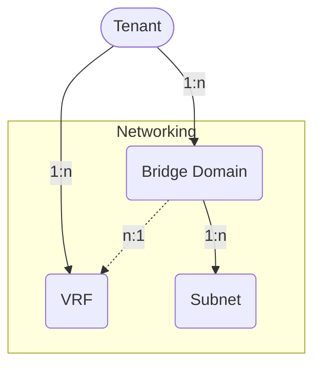

# Networking

Network-layer tenant objects: VRFs, Bridge Domains, their subnets, and L3Out bindings.

## VRF

A *VRF (virtual routing and forwarding)* instance defines a unique layer 3
forwarding, address and application policy domain for a *Tenant*.
The layer 3 domain must have unique IP addresses.
A *Tenant* can contain multiple VRFs.
Bridge Domains are associated with a VRF.

The *ACIVRF* model has the following fields:

*Required fields*:

- **Name**: represent the VRF name in the ACI.
- **ACI Tenant**: a reference to the `ACITenant` model.

*Optional fields*:

- **Name alias**: a name alias in the ACI for the VRF.
- **Description**: a description of the VRF.
- **NetBox Tenant**: a reference to the NetBox tenant model.
- **NetBox VRF**: a reference to the NetBox vrf model.
- **BD enforcement enabled**: a boolean field, whether endpoints can ping other
  bridge domain gateways.
    - Default: `false`
- **DNS labels**: a comma-separated list of DNS labels.
- **IP data plane learning enabled**: a boolean field representing whether IP
  data plane learning is enabled for the VRF.
    - Default: `true`
- **PC enforcement direction**: Direction of policy control enforcement.
    - Values: `ingress` (ingress), `egress` (egress)
    - Default: `ingress`
- **PC enforcement preference**: Preference of policy control enforcement.
    - Values: `enforced` (enforced), `unenforced` (unenforced)
    - Default: `enforced`
- **PIM IPv4 enabled**: a boolean field, whether IPv4 multicast is enabled.
    - Default: `false`
- **PIM IPv6 enabled**: a boolean field, whether IPv6 multicast is enabled.
    - Default: `false`
- **Preferred group enabled**: a boolean field, if the preferred group feature
  is enabled for the VRF.
    - Default: `false`
- **Comments**: a text field for additional notes.
- **Tags**: a list of NetBox tags.

## Bridge Domain

A *Bridge Domain* represents layer 2 forwarding and flood domain defining a
unique MAC address space.
Each Bridge Domain must be linked to a VRF instance.
One or more Subnets are associated with a Bridge Domain.

The *ACIBridgeDomain* model has the following fields:

*Required fields*:

- **Name**: represent the Bridge Domain name in the ACI.
- **ACI Tenant**: a reference to the `ACITenant` model.
- **ACI VRF**: a reference to the `ACIVRF` model.

*Optional fields*:

- **Name alias**: a name alias in the ACI for the Bridge Domain.
- **Description**: a description of the Bridge Domain.
- **NetBox Tenant**: a reference to the NetBox tenant model.
- **Advertise host routes enabled**: a boolean field, whether associated
  endpoints are advertised as host routes (/32 prefixes) out of the L3Outs.
    - Default: `false`
- **ARP flooding enabled**: a boolean field representing the state, whether
  Address Resolution Protocol (ARP) is flooded within the Bridge Domain.
    - Default: `false`
- **Clear remote mac entries enabled**: a boolean field, whether MAC endpoint
  entries should be deleted on remote leaves, when endpoints are removed from
  the local leaf.
    - Default: `false`
- **DHCP labels**: a comma-separated list of DHCP labels.
- **EP move detection enabled**: a boolean field documenting the state of
  endpoint move detection based on Gratuitous ARP (GARP).
    - Default: `false`
- **IGMP interface policy name**: the name of the IGMP interface policy.
- **IGMP snooping policy name**: the name of the IGMP snooping policy.
- **IP data plane learning enabled**: a boolean field representing whether IP
  data plane learning is enabled for the Bridge Domain.
    - Default: `true`
- **Limit IP learn enabled**: a boolean field, if IP learning is limited to the
  Bridge Domain's subnets.
    - Default: `true`
- **MAC address**: the MAC address of the Bridge Domain's gateway.
    - Default: `00:22:BD:F8:19:FF`
- **Multi destination flooding**: forwarding method for layer 2 multicast,
  broadcast and link layer traffic.
    - Values: `bd-flood` (Bridge Domain flood),
      `encap-flood` (encapsulation flood), `drop` (drop)
    - Default: `bd-flood`
- **PIM IPv4 enabled**: a boolean field, whether IPv4 multicast is enabled.
    - Default: `false`
- **PIM IPv4 destination filter**: the name of the PIM IPv4 destination filter.
- **PIM IPv4 source filter**: the name of the PIM IPv4 source filter.
- **PIM IPv6 enabled**: a boolean field, whether IPv6 multicast is enabled.
    - Default: `false`
- **Unicast routing enabled**: a boolean field, whether unicast routing is.
  enabled.
    - Default: `true`
- **Unknown IPv4 multicast**: defines the IPv4 unknown multicast forwarding
  method.
    - Values: `flood` (flood), `opt-flood` (optimized flood)
    - Default: `flood`
- **Unknown IPv6 multicast**: defines the IPv6 unknown multicast forwarding
  method.
    - Values: `flood` (flood), `opt-flood` (optimized flood)
    - Default: `flood`
- **Virtual MAC address**: the virtual MAC address of the Bridge Domain / SVI
  used when the Bridge Domain is extended to multiple sites using L2Outs.
- **Comments**: a text field for additional notes.
- **Tags**: a list of NetBox tags.

## Bridge Domain Subnet

A *Bridge Domain Subnet* is an anycast gateway IP address of the Bridge Domain.
The Subnet must be linked to a Bridge Domain instance.
One or more Subnets can be associated with a Bridge Domain, but only one Subnet
can be preferred.

The *ACIBridgeDomainSubnet* model has the following fields:

*Required fields*:

- **Name**: represent the Bridge Domain name in the ACI.
- **ACI Bridge Domain**: a reference to the `ACIBridgeDomain` model.
- **Gateway IP Address**: the gateway IP address of the Bridge Domain
  (referencing the NetBox IP address).

*Optional fields*:

- **Name alias**: a name alias in the ACI for the Bridge Domain Subnet.
- **Description**: a description of the Bridge Domain Subnet.
- **NetBox Tenant**: a reference to the NetBox tenant model.
- **Advertised externally enabled**: a boolean field, whether the subnet is
  advertised to the outside to any associated L3Outs (public scope).
    - Default: `false`
- **IGMP querier enabled**: a boolean field specifying whether the gateway
  IP address is treated as an IGMP querier source IP.
    - Default: `false`
- **IP data plane learning enabled**: a boolean field representing whether
  IP data plane learning is enabled for the Bridge Domain Subnet.
    - Default: `true`
- **No default SVI gateway**: a boolean field, if the default gateway
  functionality of the address is removed.
    - Default: `false`
- **ND RA enabled**: a boolean field, whether the gateway IP is treated as an
  IPv6 Neighbor Discovery Router Advertisement prefix.
    - Default: `true`
- **ND RA prefix policy name**: the name of the Neighbor Discovery Router
  Advertisement prefix policy.
- **Preferred IP address enabled**: a boolean field, if the gateway IP address
  is the preferred (primary) IP gateway of the Bridge Domain.
    - Default: `false`
- **Shared enabled**: a boolean field, if endpoints can communicate only within
  the same (*disabled*) or shared VRFs (*enabled*) in the ACI fabric
  (inter-VRF route leaking).
    - Default: `false`
- **Virtual IP enabled**: a boolean field determining if the gateway is a
  virtual IP address (used for stretched Bridge Domains to multiple sites).
    - Default: `false`
- **Comments**: a text field for additional notes.
- **Tags**: a list of NetBox tags.

## Bridge Domain L3Out Binding

A *Bridge Domain L3Out Binding* links an ACI Bridge Domain to an ACI L3Out. The
binding documents which L3Outs are associated with a Bridge Domain for routed
external connectivity.

The *ACIBridgeDomainL3OutBinding* model has the following fields:

*Required fields*:

- **ACI Bridge Domain**: a reference to the `ACIBridgeDomain` model.
- **ACI L3Out**: a reference to the `ACIL3Out` model.

*Optional fields*:

- **Comments**: a text field for additional notes.
- **Tags**: a list of NetBox tags.
